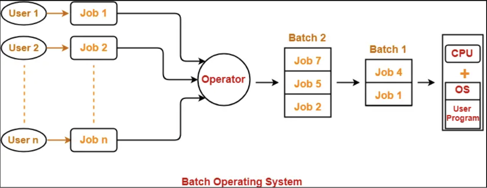

# Types of Operating Systems

## Types of OS 🎉

- **Single processing OS** [MS-DOS 1981]
- **Batch-processing OS** [ATLAS, Manchester Univ., 1950s-1960s]
- **Multi-programming OS** [THE, DIJKSTRA, early 1960s]
- **Multi-tasking OS** [CTSS, MIT, early 1960s]
- **Multi-processing OS** [Windows NT]
- **Distributed System** [LOCUS]
- **Real-time OS** [ATCS]

---

## ~> Details of OS 🤓

### **1. Single processing OS**
- Only 1 process executes at a time from the ready queue (**OLDEST**)

---

### **2. Batch-processing OS**
- Firstly, user prepares his job using punch cards.
- Then, he submits his job to the computer operator.
- Operator collects the jobs from different users and sorts the jobs into batches with similar needs.
- Then, operator submits the batches to the processor one by one.
- All the jobs of one batch are executed together.

- Priorities cannot be set, if a job comes with some higher priority.
- May lead to starvation. (A batch may take more time to complete)
- CPU may become idle in case of I/O operations.

---

### **3. Multi-programming OS**
- Single CPU
- Maintains a ready queue. It increases CPU utilization by keeping multiple jobs (codes & data) in the memory so that the CPU always has some job to execute in case the currently running job gets busy with I/O.
- Context Switching for process
- Switch happens when current process goes to the wait state.
- When context switching, the running program writes/saves details in PCB (process control block).
- CPU idle time reduces.

---

### **4. Multi-tasking OS**
- Almost similar to Multi-programming OS + time-sharing
- Each process is executed for a maximum fixed interval of time, then another program is sent to the CPU.
- It is also known as *`time-sharing systems`*.

---

### **5. Multi-processing OS**
- More than 1 CPU in a single computer
- Increases reliability, if 1 CPU fails, the other is still running.
Better throughput
- Lesser process starvation (if 1 process is running on 1 CPU, another process can run on another CPU)

---

### **5. Distributed OS**
- OS manages many bunches of resources,
- `>= 1 CPU, >= 1 memory, >= 1 GPU, etc.`
- Loosely connected autonomous, interconnected nodes
- Collection of independent, networked, communicating, and physically separate computational nodes.

---

### **6. Real-time OS (RTOS)**
- Real-time, error-free, computations within time-tight boundaries.
- Air-traffic control system, ROBOTS, etc.

