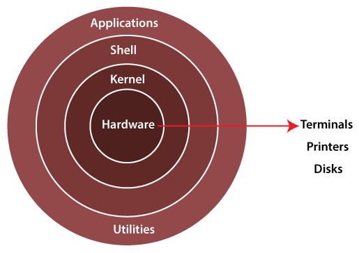

# Components of Operating System



## Components of OS 😈

1. **Kernel:** A kernel is that part of the operating system which interacts directly with
the hardware and performs the most crucial tasks.
    - Heart of OS/Core component
    - Very first part of OS to load on start-up.

2. **User space:** Where application software runs, apps don’t have privileged access to the
underlying hardware. It interacts with kernel.
    - GUI
    - CLI

!!! success "shell/ Command Interpreter"
    A **shell**, also known as a **command interpreter**, is that part of the operating system that **`receives commands from the users and gets them executed.`**

---

## CPU execution modes 🚦

There are two modes in which CPU can execute code:

1. **User mode**
    - non-privileged mode.
    - used to run user applications and programs defined in **user space**.

2. **Kernel mode**
    - privileged mode.
    - used to run the kernel and core OS services (defined in **kernel space**).

!!! info "Kernel mode"
    When you are typing `mkdir newDir` in terminal, the `mkdir` command is running in user mode, but the `mkdir` command is calling the `mkdir` **system call** which is running in kernel mode.

    - CPU execution switches from `user mode` to `kernel mode`.
    - This is done by **system interrupts**.
    - *The switching takes some time, so it's not good to switch frequently*.
---

## Functions of Kernel 👮🏻‍♂️

!!! note "1. Process management"
    - Scheduling processes and threads on the CPUs.
    - Creating & deleting both user and system process.
    - Suspending and resuming processes
    - Providing mechanisms for process synchronization or process communication.

!!! note "2. Memory management"
    - Allocating and deallocating memory space as per need.
    - Keeping track of which part of memory are currently being used and by which process.

!!! note "3. File management"
    - Creating and deleting files.
    - Creating and deleting directories to organize files.
    - Mapping files into secondary storage.
    - Backup support onto a stable storage media.

!!! note "4. I/O management"
    - to manage and control I/O operations and I/O devices
    - Buffering (data copy between two devices), caching and spooling.
        - Within differing speed two jobs.
        - Eg. Print spooling and mail spooling.
    - Buffering
        - Within one job.
        - Eg. Youtube video buffering
    - Caching
        - Memory caching, Web caching etc.

??? failure "what is spooling?"
    - **Spooling** is a process in which data is temporarily held to be used and executed by a device, program or the system. It is a place where data is stored to be processed or printed later.
    - In modern systems, spooling is often used when data needs to be transferred from a program to a peripheral (such as a printer).

---

## Types of Kernels 🤖

### **1. Monolithic Kernel**
- All functions are in kernel itself.
```diff
- Bulky in size.
- Memory required to run is high.
- Less reliable, one module crashes -> whole kernel is down.
+ High performance as communication is fast. (Less user mode, kernel mode overheads)
```
- Eg. **Linux, Unix, MS-DOS**.

---

### **2. Micro Kernel**
- Only major functions are in kernel.
    - Memory management.
    - Process management.
- File management and IO management are in User-space.
```diff
+ smaller in size.
+ More Reliable
+ More stable
- Performance is slow (bcoz of switching between user mode and kernel mode)
- Overhead switching b/w user mode and kernel mode.
```
- Eg. **L4 Linux, Symbian OS, MINIX** etc.

---

### **3. Hybrid Kernel**

- Advantages of both worlds. (File management. in User space and rest in Kernel space. )
```diff
+ Combined approach.
+ Speed and design of mono.
+ Modularity and stability of micro.
```
- Eg. **MacOS, Windows NT/7/10**
- IPC also happens but lesser overheads

---

### **4. Exo kernels**
- Smallest in size.
- Only basic functions.
- Rest in user space.
```diff
- has fewest hardware abstractions as possible.
- It allocates physical resources to applications.
```
---

### **5. Nano Kernel**
- It is the type of kernel that offers hardware abstraction but without system services.
- Micro Kernel also does not have system services therefore **the Micro Kernel and Nano Kernel have become analogous.**
- The main difference between the two is that the Nano Kernel is designed to be as small as possible.
- `Micro kernels` which actually are **micro** in size are also called `nano kernels`.

??? info "Nano/Exo kernels"
    a type of operating system kernel that has a minimal and streamlined design, with a focus on minimalism and efficiency. The goal of a nano kernel is to provide only the essential functions required for the operation of a system while delegating other functions to user-space processes.

---

## Communication b/w User mode and Kernel mode 📡
???+ danger "Q. How will communication happen between user mode and kernel mode?"
    -   **Inter process communication (IPC)**. This can be done in two ways:
        - **Shared memory:** 
            - A region of memory that is shared between two processes.
            - One process writes to the shared memory and the other process reads from it.
        - **Message passing:** 
            - A logical channel is established between two processes.
            - A process sends a message to another process and the other process receives it.
            - Eg. **pipes, sockets, message queues, signals, semaphores, shared memory, and message passing.**
