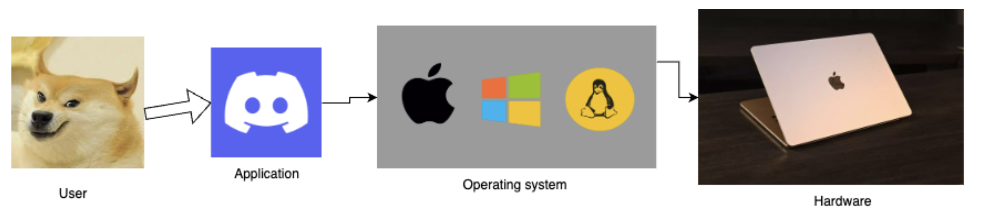

# Introduction to Operating System

- **Application software:** performs specific task for the user.

- **System software:** operates and controls the computer system and provides a platform to run
application software.

???+ danger "What is an Operating System?"
    An operating system is a piece of software that manages all the resources of a computer
    system, both hardware and software, and provides an environment in which the user can
    execute his/her programs in a convenient and efficient manner by hiding underlying
    complexity of the hardware and acting as a resource manager.

    - It is a system software that acts as an interface between the user and the computer.

---

## Why OS?
1. **What if there is no OS?**
    - Bulky and complex app. (Hardware interaction code must be in app’s
    code base)
    - Resource exploitation by 1 App (since there's no one to protect and manage resources)
    - No memory protection. (One app can overwrite another app's memory)

2. **What is an OS made up of?**
    - Collection of system software.

---

## Functions of an operating system

- Access to the computer hardware.
- interface between the user and the computer hardware

- Resource management (Aka, Arbitration) (memory, device, file, security, process, etc)
- Hides the underlying complexity of the hardware. (Aka, Abstraction)
- facilitates the execution of application programs by providing isolation and protection.
