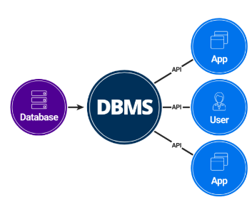

# Introduction to DBMS

## What is Data?

- Data is a collection of raw, unorganized facts and details like text, observations, figures, symbols,
and descriptions of things etc.
- **`data does not carry any specific purpose and has no significance by itself`**.

---

## What is Information?

- Information is **processed**, **organized** & **structured** data.
- Provides `context of data` & `helps in decision making`.

---

## Data vs information

!!! info
    - Data is collection of facts, while information puts those facts into context.
    - Data on its own is meaningless. When it's analyzed and interpreted, it becomes meaningful information.

---

## What is `Database`?

- Database is an electronic place/system where data is stored in a way that it can be easily **accessed**, **managed** & **updated**.

---

## What is DBMS?

    

!!! success "DBMS definition"
    - A DBMS is the database itself, along with all the software and functionality, to provide a way to store and retrieve database information that is both convenient and efficient.

    - It is used to perform different operations, like addition, access, updating, and deletion of the data.

---

## Why not directly use **file-system**?

!!! bug "file-system has major disadvantages"
    1. **Data redundancy and consistency** (same data can be present in multiple locations and they might even be not consistent. Data of same user can be different in different locations.)

    2. **Difficulty in accessing data** (file system is good for normal tasks, but it’s not optimized for accessing data using complex queries.)

    3. **Data isolation** (unrelated data can be present in the same location)

    4. **Integrity problems** (A person with less than 18 years of age should not be able to register, holding such constraints is difficult to implement)

    5. **Atomicity problems** (for a batch of transactions, either the whole transaction should be successful or whole should fail, like, when user A sends money to user B, the two actions: addition of amount in B’s balance and deduction of amount in A’s balance, should either both be successful or both fail.)

    6. **Concurrent-access anomalies** (If credit card is being used by me and my wife, then concurrent access should be supported and expected issues should be taken care of.)

    7. **Security problems** (we want some data to be available to the developers but don’t want whole data to be available to them).

- It’s not like, we can’t implement above features in the file-system. We obviously can, but, it is a tedious task in itself, plus, we would be required to do it every time.
- `DBMS has taken care of all these issues, so we can use them directly`.
