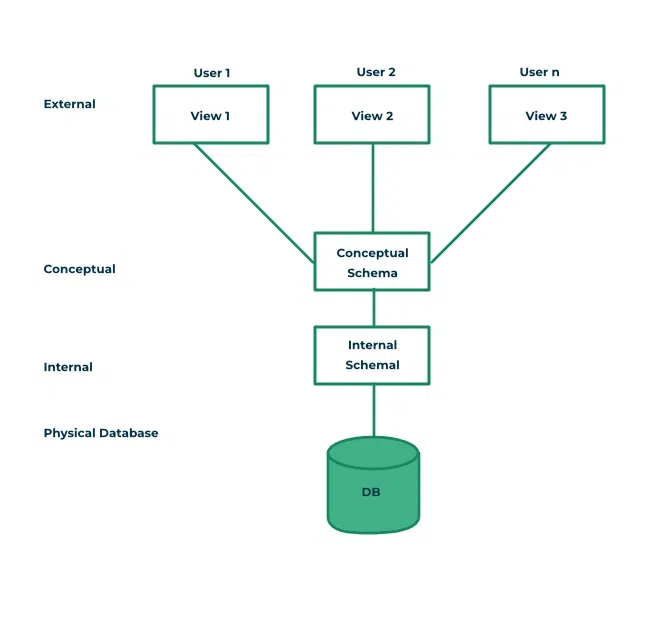

# Architecture of DBMS

- The major purpose of DBMS is to provide users with an abstract view of the data. That is, the system hides certain details of how the data is stored and maintained.
- To simplify user interaction with the system, abstraction is applied through several levels of abstraction.

---

## Three-Schema architecture (`View of data`)

- The main objective of three level architecture is to enable multiple users to access the same data with a personalized view while storing the underlying data only once.

### 1. Physical level/ Internal level

!!! info "Physical level/ Internal level"
    - The lowest level of abstraction describes how the data are stored.
    - Low-level data structures used.
    - It has Physical schema which describes physical storage structure of DB.
    - Talks about: Storage allocation (N-ary tree etc), Data compression & encryption etc.
    - **Goal**: We must define algorithms that allow efficient access to data.

---

### 2. Logical level / Conceptual level ✅

!!! info "Logical level / Conceptual level"
    - The conceptual schema describes the design of a database at the conceptual level, describes what data are stored in DB, and what relationships exist among those data.
    - User at logical level does not need to be aware about physical-level structures.
    - DBA (`database administrator`), who must decide what information to keep in the DB use the logical level of abstraction.
    - **Goal**: ease to use.

---

### 3. View level / External level

!!! info "View level / External level"
    - Highest level of abstraction aims to simplify users’ interaction with the system by providing different view to different end-user.
    - Each view schema describes the database part that a particular user group is interested and hides the remaining database from that user group.
    - At the external level, a database contains several schemas that sometimes called as sub-schema. The sub-schema is used to describe the different view of the database.
    - At views also provide a security mechanism to prevent users from accessing certain parts of DB.

    >
    > - a person working in amazon logistics, don't need to have access to user's credit card, but needs access to location.
    >
    > - another engineer in payment department of amazon, don't need to have access to user's search history or carts.
    > 
    > So, for the same db, each user has different sub-schema for them.

---

## Instances & Schema

- The collection of information stored in the DB at a particular moment is called an `instance of DB`.
- The overall design of the DB is called the `DB schema`.
- Schema is structural description of data. Schema doesn’t change frequently. Data may change frequently.
- We have **3 types of Schemas**: **`Physical`**, `**Logical**`, **`several view schemas`** called sub-schemas.

!!! tip
    - **`Logical schema`** is `most important` in terms of its effect on application programs, as programmers construct apps by using logical schema.
    - Physical data independence, physical schema change should not affect logical schema/application programs.

---

## Data models

- Provides a way to describe the design of a DB at logical level.
- Underlying the structure of the DB is the Data Model; a collection of conceptual tools for `describing data`, `data relationships`, `data semantics` & `consistency constraints`.

- E.g., `ER model`, `Relational Model`, `object-oriented model`, `object-relational data model`, etc.

---

## Database Languages

- **Data definition language (DDL)** to specify the db schema. (like, constraints, which must be checked before each updation)
- **Data manipulation language (DML)** to express db queries & updates.

Practically, both languages are present in a single DB language, e.g., SQL language.

---

## How is `database` accessed from application programs?

- Interface is provided in the host languages (like c, c++, java, etc), that convert normal statement into DML statements & then send it to DB, and finally return the response.
    - Open Database Connectivity (**ODBC**), Microsoft C
    - Java Database Connectivity (**JDBC**), Java

- **ORMs (`object-relation mapper`)**: ORM is a computer technique that maps the schema of a relational database to the classes of an object-oriented programming language.
    - SQLAlchemy
    - Mongoose
    - Prisma

---

## DBA (`Database administrator`)

- A person who has central control of both the data & the programs that access those data.

???+ quote "Functions of DBA"
    - Schema definition
    - storage structure & access methods
    - schema & physical organization modifications
    - Authorization control
    - routine maintenance:
        - periodic backups
        - security patches
        - any upgrades

---

## DBMS **application** architecture

Depending on the relative location of client & server and how do they communicate, we have three types of `DBMS Application architecture`.

1. **Tier-1 architecture**: The client, server & DB all present on the same machine.
2. **Tier-2 architecture**: DB is in some remote server, and client connects directly to DB and communicates.
3. **Tier-3 architecture**: The client communicates with `app server`, that in turn communicates with `DB server`.

!!! Comparison
    Obviously, tier-3 is the most scalable & safe for WWW applications.
