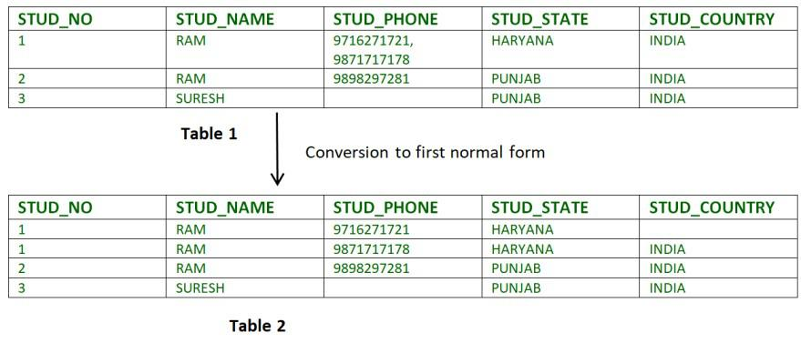
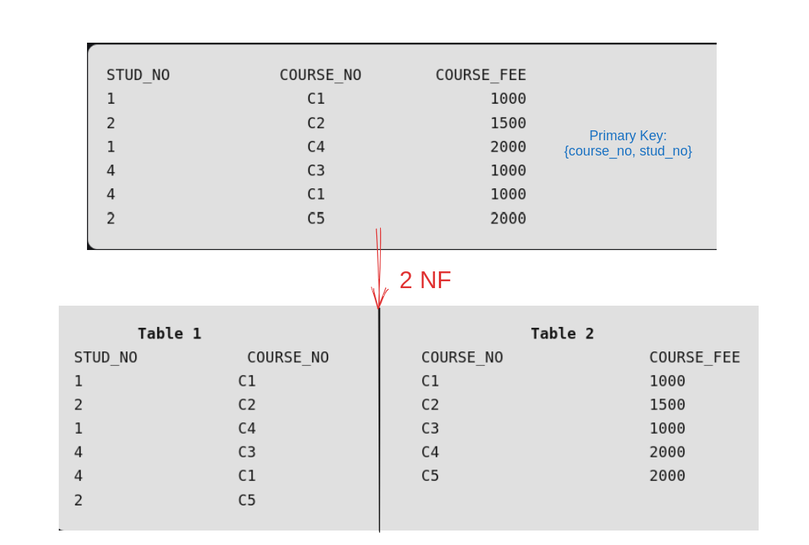
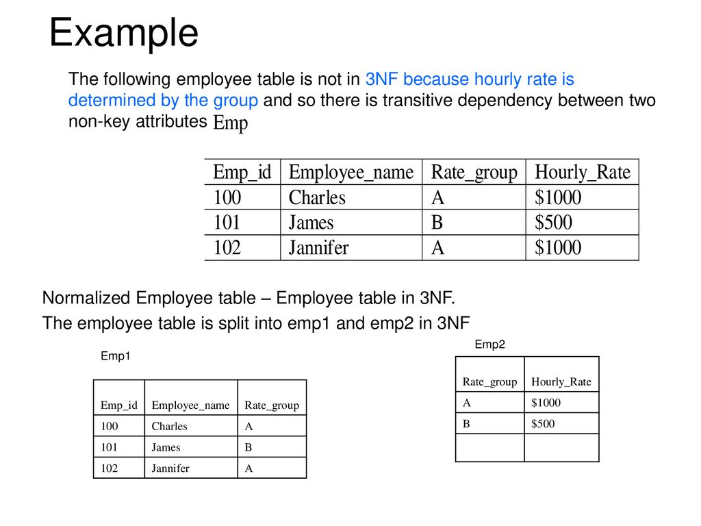
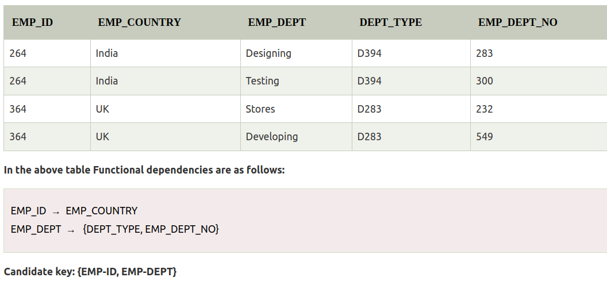
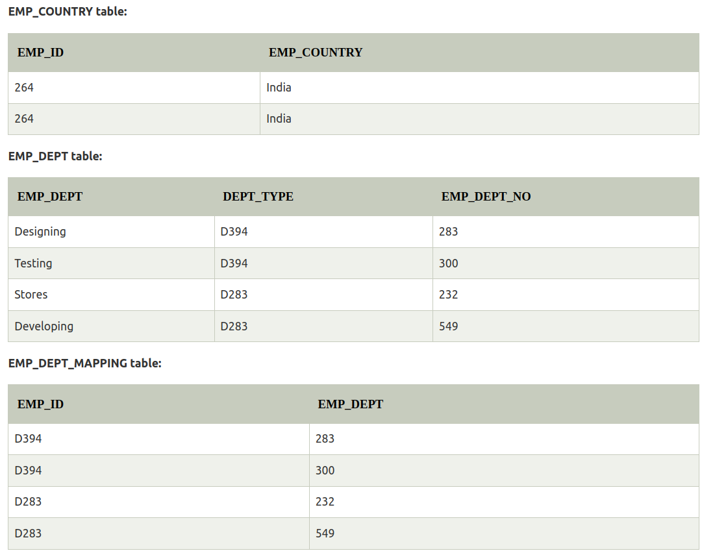
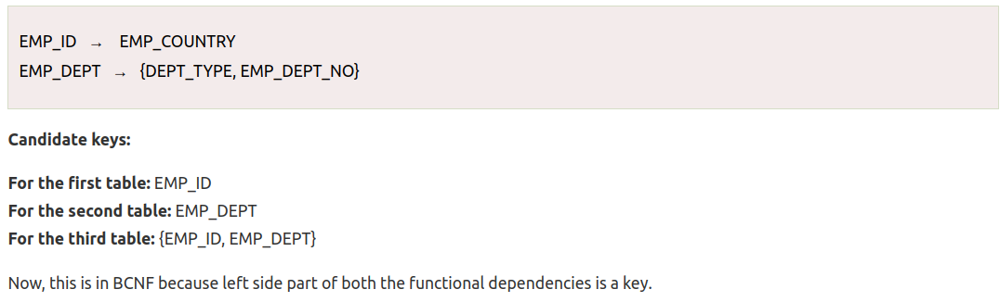
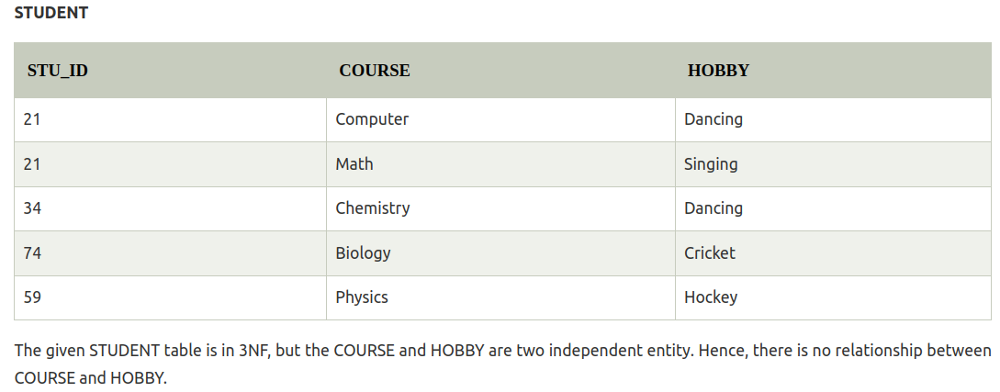
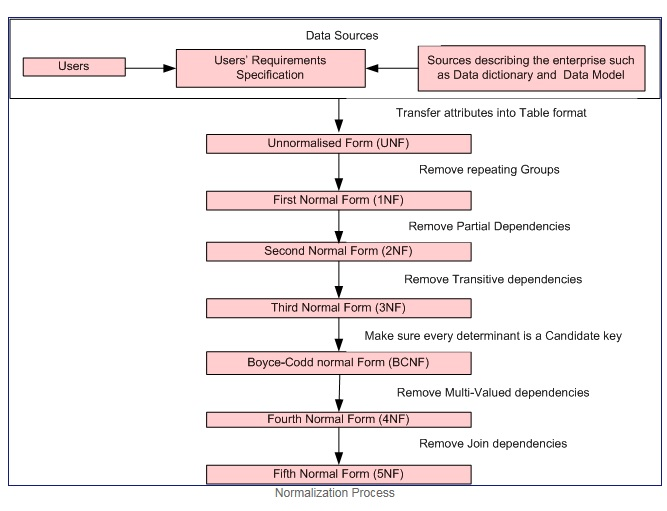

# Normalization

!!! success "What is Normalization?"
    - **Normalization divides the larger table into smaller and links them using relationships**.

- Normalization is the process of organizing the data in the database.

- Normalization is used to minimize the redundancy from a relation or set of relations. It is also used to eliminate undesirable characteristics like Insertion, Update, and Deletion Anomalies.

- The normal form is used to reduce redundancy from the database table.

---

## Functional Dependency (`FD`)

- relationship between the primary key attribute (usually) of the relation to that of the other attribute of the relation.

- `X => Y`, the left side of FD is known as a `Determinant`, the right side of the production is known as a `Dependent`.
- If we can determine Y from X in a table, we say FD exists between `X => Y`.

---

### Types of FD 💃

#### 1. Trivial FD

- `A => B` has trivial functional dependency if **`B is a subset of A`**. `A->A`, `B->B` are also Trivial FD.

??? example
    A table with primary key **`{student_id, student_name}`** will have trivial functional dependency with **`{student_name}`**, as it is already subset.

#### 2. Non-trivial FD

- `A => B` has non-trivial functional dependency if **`B is not a subset of A`**. [A intersection B is NULL.]

??? example
    A table with primary key **`{student_id}`** will have trivial functional dependency with **`{student_name}`**, as it is not a subset.

---

### Rules of FD (`Armstrong’s axioms`) 🌉

#### 1. Reflexive

- If `‘A’ is a set of attributes` and `‘B’ is a subset of ‘A’`. Then, `A => B` holds.

- If A \(\supseteq\) B then `A => B`.

#### 2. Augmentation

- If B can be determined from A, then adding an attribute to this functional dependency won't change anything.
- If `A=>B` holds, then `AX=>BX` holds too, 'X' being a set of attributes.

#### 3. Transitivity

- If `A determines B`, and `B determines C`, then, **`A determines C`**.
- If `A=>B` & `B=>C`, then, **`A=>C`**.

???+ example
    - Reflexive
        - If `{student_id, student_name}` is primary key, and `{student_name}` is an attribute, then, there exists reflexive FD.

    - Augmentation
        - If we can determine `{student_age}` from primary key `{student_id}`, i.e., functional dependency exists between the two, then, FD also exists between `{student_id, student_name}` & `{student_age, student_name}`.

    - Transitivity
        - If `{student_id}` can determine `{student_email}`, and `{student_email}` can help us uniquely identify `{student_age}`, then, we can determine `{student_age}` from `{student_id}`, i.e., FD exists between the two.

---

## Why Normalization?

- To **avoid redundancy** in the DB, not to store redundant data.

---

## What happens if we have redundant data?

!!! bug "Problems with redundant data"
    - **Insertion**, **deletion** & **updation** anomalies arises.

---

## Anomalies

- Anomalies means **`abnormalities`**.

- Let's suppose, we have a table that stores **college student details along with the branch they are in and their HOD**.

| Student_id      | Name                          | email | branch | HOD |
| :---------: | :----------------------------------: | :---------: | :---------: | :---------: |
| 101       | Max  | max[at]gmail.com      | Mechanical      |Prof Andrew NG       |
| 102       | William |william[at]gmail.com     | CSE     | Prof Yan lecun       |
| 103    | Rohit |rohit[at]gmail.com       | Electronics      | Prof Zuckerberg      |
| 104    | Virat |virat[at]gmail.com       | Civil      | Prof Brock Lesnar       |
| 105   | Dhoni |dhoni[at]gmail.com      | Electrical       | Prof Mia Khalifa       |

---

### Insertion Anomaly

- When certain data (attribute) cannot be inserted into the DB without the presence of other data.
- Now, if the college started `AI/ML` branch too, there's no way to have this information in the table until there's some student in the branch.

### Deletion Anomaly

- Deletion anomaly refers to the situation where the deletion of data results in the unintended loss of some other important data.
- If `Rohit` from the above table graduates and leaves college, the whole row will be dropped, and we will also lose the information that `Electronics` course is available in the college.

### Updation anomaly

- The update anomaly is when an update of a single data value requires multiple rows of data to be updated.
- Due to updation to many places, **data inconsistency** may arise, if one forgets to update the data at all the intended places.
- In the table, if the HOD of CSE is changed, we will be required to update all the rows which has CSE branch as its branch. (`multiple updation`)

!!! quote ""
    - Due to these anomalies, **DB size increases, and DB performance slows down.**
    - To rectify these anomalies, we use **`Normalization`**.

---

## What is Normalization?

- Normalization is used to minimize the redundancy from a relations.
- It is also used to eliminate undesirable characteristics like Insertion, Update, and Deletion Anomalies.
- Normalization divides the composite attributes into individual attributes OR larger table into smaller and links them using relationships.
- The normal form is used to reduce redundancy from the database table.

---

## Types of `Normal forms`

### 1NF (`First Normal Form`)

- It states that an attribute of a table cannot hold multiple values. 
- It must hold only single-valued attribute.
- First normal form disallows the multi-valued attribute, composite attribute, and their combinations.

---

### 2NF (`Second Normal Form`)

- Relation must be in `1NF`.
- There should be **no partial dependency**.
    - All non-prime attributes must be fully dependent on PK.
    - Non prime attribute can not depend on the part of the PK (or proper subset of PK).

??? tip "explanation"
    Primary key: `{course_no, stud_no}`. But, attribute `{course_fee}` can be described completely by `{course_no}`, which is a subset of primary key, hence, to make it `Second normal form`, we split it into two tables.

---

### 3NF (`Third Normal Form`)

- Relation must be in `2NF`.
- No transitivity dependency exists:
    - Non-prime attribute should not find a non-prime attribute.

??? tip "explanation"
    `{emp_id}` can determine `{rate_group}`, and `{rate_group}` can determine `{hourly_rate}`.

    - So, transitive dependency exists, i.e., `{emp_id}` can determine `{hourly_rate}`.

    - To remove this, we split into two tables.

---

### BCNF (`Boyce-Codd normal form`)

- Relation must be in 3NF.
- FD: A -> B, A **must be a super key**.
    - We must not derive prime attribute from any prime or non-prime attribute.

- For BCNF, the table should be in 3NF, and for every FD, **`LHS is super key`**.

- The `table is not in BCNF because neither EMP_DEPT nor EMP_ID alone are keys`.

- To convert the given table into BCNF, we decompose it into three tables:

- **functional dependencies**

!!! success
    After BCNF, most of the redundancy has been removed.

---

### 4NF (`Fourth normal form`)

- A relation will be in 4NF if it is in Boyce Codd normal form and has **no multi-valued dependency**.
- For a dependency A → B, if for a single value of A, multiple values of B exists, then the relation will be a multi-valued dependency.

- Split into two tables.

---

### 5NF (`Fifth normal form`)

- it is in 4NF
- from 1NF to 4NF, it was all about splitting into multiple tables.
- 5th NF is about joining multiple tables, and the joining should be lossless.
- Multiple tables can be joined in any order and the final table should not contain any less or any more entries, i.e., `lossless joining`.
- 5NF is also known as **Project-join normal form (PJ/NF)**.

- **A relation is in 5NF, if it is in 4NF, and not having any join dependency and joining should be lossless**.

---

## Summary

---

## Advantages of Normalization

!!! success
    - Normalization helps to minimize data redundancy.
    - Greater overall database organization.
    - Data consistency is maintained in DB.
