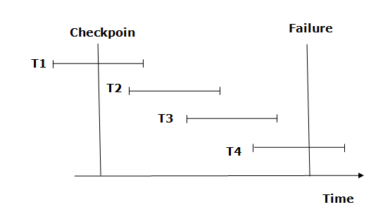

# How to implement `Atomicity` & `Durability` in transactions?

- **Recovery Mechanism Component** of DBMS supports atomicity and durability.

---

## Shadow-Copy Scheme

!!! info "Shadow-Copy scheme"
    1. Based on making copies of DB (aka, shadow copies).
    2. **Assumption only one Transaction (T) is active at a time**.
    3. A pointer called **db-pointer** is maintained on the disk; which `at any instant points to current copy of DB`.
    4. T, that wants to update DB `first creates a complete copy of DB`.
    5. `All further updates are done on new DB copy leaving the original copy (shadow copy) untouched`.
    6. **`If at any point the T has to be aborted the system deletes the new copy. And the old copy is not affected`**.
    7. If T success, it is committed as,
        - OS makes sure all the pages of the new copy of DB written on the disk.
        - DB system updates the db-pointer to point to the new copy of DB.
        -  New copy is now the current copy of DB.
        -  The old copy is deleted.
        -  The T is said to have been COMMITTED at the point where the updated db-pointer is written to disk.

    ---

    > **Atomicity**

    - If T fails at any time before db-pointer is updated, the old content of DB is not updated.
    - T abort can be done by just deleting the new copy of DB.
    - Hence, either all updates are reflected or none.

    ---

    > **Durability**

    - Suppose system fails at any time before the db-pointer is written to the disk.
    - When the system restarts, it will read db-pointer & will see the original contents of the DB, and none of the effects of T will be visible.
    - **T is assumed to be successful only when db-pointer is updated**.
    - If system fails after db-pointer has been updated. Before that, all the pages of the new copy were written to the disk. Hence, when system restarts, it will read new DB copy.

!!! bug "A very important note about writing Disk updates"
    The implementation is dependent on write to the db-operation being atomic.

    - Luckily, **disk system provides atomic updates to entire block or at least a disk sector. So, we make sure db-pointer lies entirely in a single sector. By storing db-pointer at the beginning of a block**.

!!! danger "Problem with `Shadow-Copy Scheme`"
    - This approach is very **inefficient**, as we are storing the copy of the whole db in memory for each transaction.
    - Will we read 1 tb DB size each time??

---

## Log-Based recovery method

- log is a sequence of records.
- **`Log of each transaction is maintained in some stable storage so that if any failure occurs, then it can be recovered from there`**.
- If any operation is performed on the database, then it will be recorded in the log.
- But the **process of storing the logs should be done before the actual transaction is applied in the database**.
- **Stable storage is a classification of computer data storage technology that guarantees atomicity for any given write operation and allows software to be written that is robust against some hardware and power failures**.

### Deferred DB Modifications

!!! example ""
    - Ensuring atomicity by recording all the DB modifications in the log but **deferring the execution of all the write operations until the final action of the T has been executed**.
    - Log information is used to execute deferred writes when T is completed.
    - If system crashed before the T completes, or if T is aborted, the information in the logs are ignored.
    - If T completes, the records associated to it in the log file are used in executing the deferred writes.
    - If failure occur while this updating is taking place, we preform redo.

---

### Immediate DB Modifications

!!! example ""
    1. DB modifications to be output to the DB while the T is still in active state.
    2. DB modifications written by active T are called uncommitted modifications.
    3. In the event of crash or T failure, system uses old value field of the log records to restore modified values.
    4. Update takes place only after log records in a stable storage.
    5. Failure handling
        1. System failure before T completes, or if T aborted, then old value field is used to undo the T.
        2. If T completes and system crashes, then new value field is used to redo T having commit logs in the logs.

---

### Difference between the two (`Deferred Vs Immediate`)

!!! info ""
    - **Deferred** logs what it will do, and but the updates to DB are not done immediately, but rather stored in buffer. Once the whole process is over, it will go one by one over the logs, and actually execute. If before the update were committed, system crashed, means, nothing could be updated in DB. In that case, it will restart executing the logs.

!!! info ""
    - **Immediate** logs will log what it will do, then does that, and proceeds like this. If the system crashes before the execution could finish or commit, when the system will restart, it will backtrack the logs and undo the operations. In case it logged committed, but before committing, system crashed, it will redo the operations based on logs. 

- **Deferred** only read the current state, whereas **Immediate** logs also store the previous and new value (helpful in case of backtrack (rollup)).

---

## Checkpoint

- The checkpoint is a type of mechanism where all the previous logs are removed from the system and permanently stored in the storage disk.

- The checkpoint is like a bookmark. While the execution of the transaction, such checkpoints are marked, and the transaction is executed then using the steps of the transaction, the log files will be created.

- When it reaches to the checkpoint, then the transaction will be updated into the database, and till that point, the entire log file will be removed from the file. Then the log file is updated with the new step of transaction till next checkpoint and so on.

- The checkpoint is used to declare a point before which the DBMS was in the consistent state, and all transactions were committed.

!!! quote "Recovery using checkpoint"
    

    - The recovery system reads log files from the end to start. It reads log files from T4 to T1.
    - Recovery system maintains two lists, a redo-list, and an undo-list.
    - The transaction is put into redo state if the recovery system sees a log with <Tn, Start> and <Tn, Commit> or just <Tn, Commit>. In the redo-list and their previous list, all the transactions are removed and then redone before saving their logs.
    - For example: In the log file, transaction T2 and T3 will have <Tn, Start> and <Tn, Commit>. The T1 transaction will have only <Tn, commit> in the log file. That's why the transaction is committed after the checkpoint is crossed. Hence it puts T1, T2 and T3 transaction into redo list.
    - The transaction is put into undo state if the recovery system sees a log with <Tn, Start> but no commit or abort log found. In the undo-list, all the transactions are undone, and their logs are removed.
    - For example: Transaction T4 will have <Tn, Start>. So T4 will be put into undo list since this transaction is not yet complete and failed amid.
