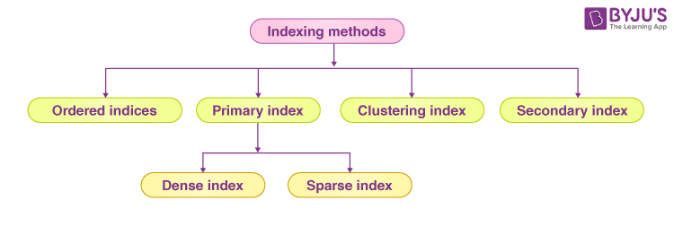
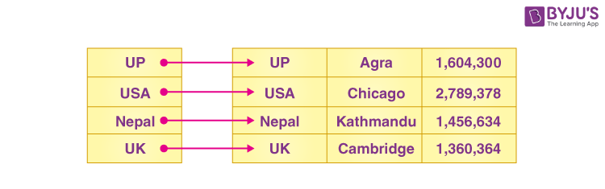
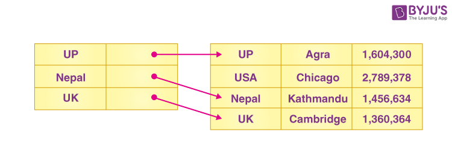
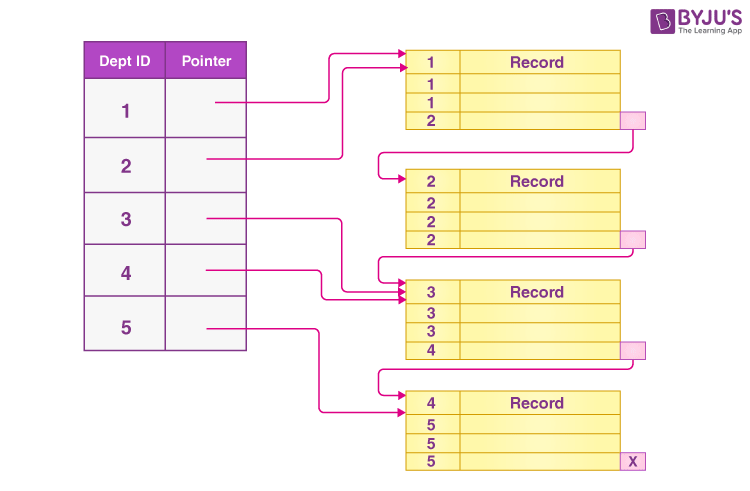
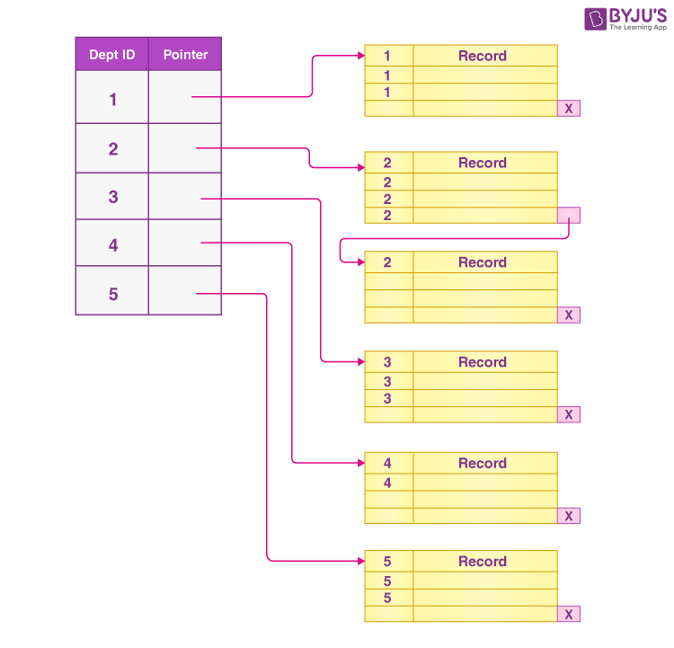
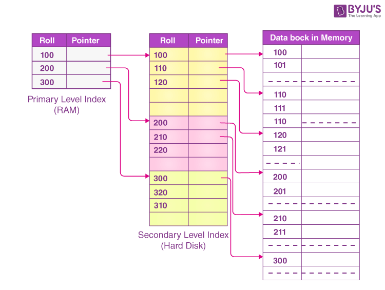

# Indexing in DBMS

## What is Indexing in DBMS?

Indexing is a technique for improving database performance by reducing the number of disk accesses necessary when a query is run. An index is a form of data structure. It’s used to swiftly identify and access data and information present in a database table.

---

## Structure of Index

- We can create indices using some columns of the database.

- The search key is the database’s first column, and it contains a duplicate or copy of the table’s candidate key or primary key. The primary key values are saved in sorted order so that the related data can be quickly accessible.

- The data reference is the database’s second column. It contains a group of pointers that point to the disk block where the value of a specific key can be found.

---

## Method of Indexing

---

## Ordered Indices

To make searching easier and faster, the indices are frequently arranged/sorted. Ordered indices are indices that have been sorted.

Example

Let’s say we have a table of employees with thousands of records, each of which is ten bytes large. If their IDs begin with 1, 2, 3,…, etc., and we are looking for the student with ID-543:

- We must search the disk block from the beginning till it reaches 543 in the case of a DB without an index. After reading 543*10=5430 bytes, the DBMS will read the record.
- We will perform the search using indices in the case of an index, and the DBMS would read the record after it reads 542*2 = 1084 bytes, which is significantly less than the prior example.

---

## Primary Index

- Primary indexing refers to the process of creating an index based on the table’s primary key. These primary keys are specific to each record and establish a 1:1 relationship between them.
- The searching operation is fairly efficient because primary keys are stored in sorted order.
- There are two types of primary indexes: dense indexes and sparse indexes.

---

## Dense Index

Every search key value in the data file has an index record in the dense index. It speeds up the search process. The total number of records present in the index table and the main table are the same in this case. It requires extra space to hold the index record. A pointer to the actual record on the disk and the search key are both included in the index records.

---

## Sparse Index

Only a few items in the data file have index records. Each and every item points to a certain block. Rather than pointing to each item in the main database, the index, in this case, points to the records that are present in the main table that is in a gap.

---

## Clustering Index

- An ordered data file can be defined as a clustered index. Non-primary key columns, which may or may not be unique for each record, are sometimes used to build indices.
- In this situation, we’ll join two or more columns to acquire the unique value and generate an index out of them to make it easier to find the record. A clustering index is a name for this method.
- Records with comparable properties are grouped together, and indices for these groups are constructed.

!!! example
    Assume that each department in a corporation has numerous employees. Assume we utilise a clustering index, in which all employees with the same Dept_ID are grouped together into a single cluster, and index pointers refer to the cluster as a whole. Dept_Id is a non-unique key in this case.

Because one disk block is shared by records from various clusters, the previous structure is a little unclear. It is referred to as a better strategy when we employ distinct disk blocks for separate clusters.

---

## Secondary Index

When using sparse indexing, the size of the mapping grows in sync with the size of the table. These mappings are frequently stored in primary memory to speed up address fetching. The secondary memory then searches the actual data using the address obtained through mapping. Fetching the address becomes slower as the mapping size increases. The sparse index will be ineffective in this scenario, so secondary indexing is used to solve this problem.

Another level of indexing is introduced in secondary indexing to reduce the size of the mapping. The massive range for the columns is chosen first in this method, resulting in a small mapping size at the first level. Each range is then subdivided into smaller groups. Because the first level’s mapping is kept in primary memory, fetching the addresses is faster. The second-level mapping, as well as the actual data, are kept in secondary memory (or hard disk).

!!! example
    - In case we want to find the record for roll 111 in the diagram, it will look for the highest item in the first level index that is equal to or smaller than 111. At this point, it will get a score of 100.
    - Then it does max (111) <= 111 in the second index level and obtains 110. Using address 110, it now navigates to the data block and begins searching through each record until it finds 111.
    - In this method, a search is carried out in this manner. In the same way, you can insert, update, or delete data.

---

## Advantages of Indexing

!!! success ""
    - Faster access and retrieval of data.
    - IO is less.

---

## Limitations of Indexing

!!! danger ""
    - Additional space to store index table
    - Indexing Decrease performance in INSERT, DELETE, and UPDATE query.

---

## FAQs on Indexing in DBMS

??? warning "Q1. What is Indexing in DBMS?"
    Indexing refers to a data structure technique that is used for quickly retrieving entries from database files using some attributes that have been indexed. In database systems, indexing is comparable to indexing in books. The indexing attributes are used to define the indexing.

??? warning "Q2. Is indexing similar to hashing?"
    Hashing uses mathematical methods called hash functions to generate direct locations of data records on the disc, whereas indexing uses data references that contain the address of the disc block with the value corresponding to the key. As a result, there is a significant difference between hashing and indexing.

??? warning "Q3. What are the types of Indexing in DBMS?"
    Indexing in DBMS is of the following types:

    - Ordered Index
    - Primary Index
    - Clustering Index
    - Sparsing Index
