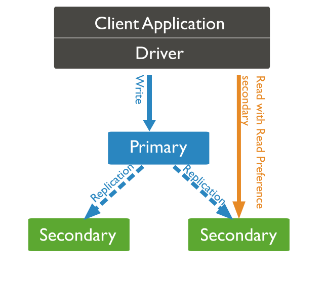
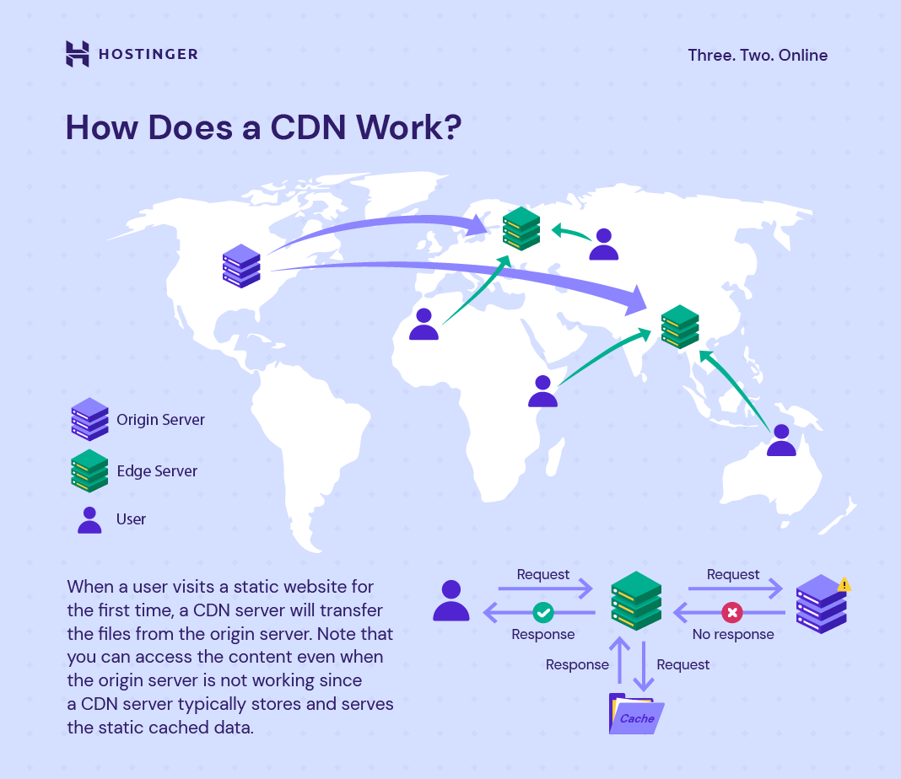

# Clustering (`Replication set`)

- **CDN (CONTENT DELIVERY NETWORK)**

## Clustering

- Database `Clustering` is the process of combining more than one servers or instances connecting a single database.
- Sometimes one server may not be adequate to manage the amount of data or the number of requests, that is when a Data Cluster is needed.

---

## Replica Set

- Replicate the same dataset on different servers.
- We will perform write operation on one server, and over time propagate updates to other servers.
- Other servers will be used for read operations.
- Increases availability and fault tolerance in case one of the server goes down.

---

!!! example "Clustering & Replica set"
    Though both are different concepts, but are used interchangeably.

---

## Advantages of `Replica Set`/ `Clustering`

- **Data redundancy**: in case one of the server goes down, data is still available on other servers.
- **Load balancing**: direct traffic to servers with least users and balance loads.
- **High availability**

---

## Content Delivery Network (`CDN`)

- CDN work on the principle of replica set.
- Has a local copy of the static data in the edge servers and can reduce server call or be available when server is down.

