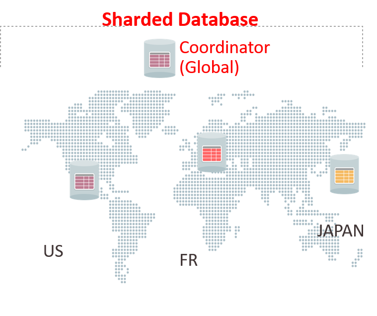

# Partitioning & Sharding

!!! quote ""
    - A big problem can be solved easily when it is chopped into several smaller sub-problems. That is what the partitioning technique does.
    - It divides a big database containing data metrics and indexes into smaller and handy slices of data called partitions.
    - The partitioned tables are directly used by SQL queries without any alteration.
    - Once the database is partitioned, the data definition language can easily work on the smaller partitioned slices,
    instead of handling the giant database altogether.
    - This is how partitioning cuts down the problems in managing large database tables.

---

## Partitioning

- technique used to divide stored database objects into separate servers.
- Due to this, there is an increase in performance, controllability of the data.
- We can manage huge chunks of data optimally. 

!!! bug "Relational V/s NOSQL DB on partitioning"
    - When we horizontally scale our machines/servers, we know that it gives us a **challenging time dealing with relational databases as it’s quite tough to maintain the relations**.
    - For performing joins, we will be required to fetch data from multiple servers and then perform join, which will be time-consuming.
    - If instead, we used **NOSQL DB**, data that will be required together will be stored together. Also, we don't care much about normalization in NOSQL, which eventually leads to **better performance and availability**.

---

### Vertical Partitioning

- Slicing relation vertically / column-wise.
- Need to access different servers to get complete tuples.

---

### Horizontal Partitioning

- Slicing relation horizontally / row-wise.
- Independent chunks of data tuples are stored in different servers.

---

## When Partitioning is Applied?

- Dataset become much huge that managing and dealing with it become a tedious task.
- the number of requests are enough larger that the single DB server is taking huge time and hence the system's response time become high.

---

## Advantages of Partitioning

!!! info ""
    - Parallelism
    - Availability
    - Performance
    - Manageability
    - Reduce cost as scaling up (vertical scaling) might be costly.

---

## Scaling Up Vs Scaling Out

!!! success ""
    - **Scaling up** => **Vertical scaling** (adding more resources (ram, cpu, etc.))
    - **Scaling out** => **horizontal scaling** (adding more servers)

---

## Distributed database

- A single logical database that is spread across multiple locations (servers) and logically interconnected by network.
- This is the product of applying DB optimization techniques like, `Clustering`, `Partitioning` & `Sharding`.

!!! tips "Why is it needed?"
    - Dataset become much huge that managing and dealing with it become a tedious task.
    - the number of requests are enough larger that the single DB server is taking huge time and hence the system's response time become high.

---

## Sharding

- Technique to implement **Horizontal scaling**
- The idea is that, **`instead of having all the data be present on one DB instance, we split it up and introduce a routing layer so that we can forward the request to the right instances that actually contain the data`**.

!!! warning ""
    - Let's say we split our DB into two DB, one will contains data of users from India, and other from USA.
    - Now, on our backend server, we will be required to implement a **routing layer**, that will query the required DB based on the country of the user.
    - This is **`Sharding`**.

---

### Pros

!!! success ""
    1. Scalability
    2. Availability

---

### Cons

!!! bug ""
    1. Complexity, making partition mapping, Routing layer to be implemented in the system, Non-uniformity that creates the necessity of Re-Sharding

    2. Not well suited for Analytical type of queries, as the data is spread across different DB instances. (Scatter-Gather problem)
