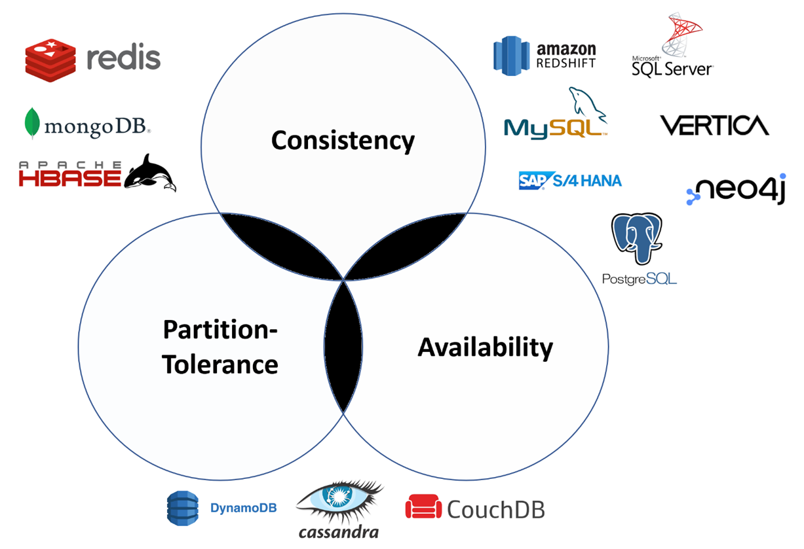
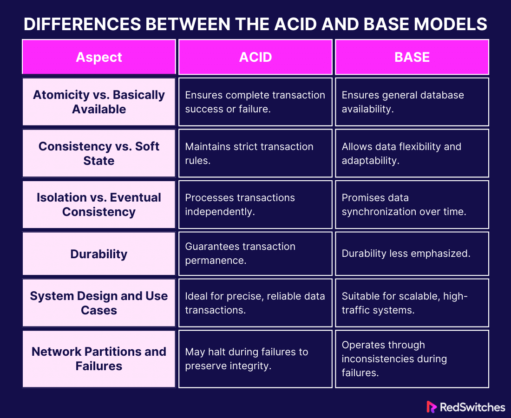

# CAP theorem (`Brewer's theorem`)

- Basic and one of the most important concept in **Distributed Databases**.

---

## CAP (`Consistency`, `Availability`, `Partition-tolerance`)

- Let's suppose we have two nodes, on one we will perform write operation, and from other node we will perform read operation.

!!! info "Consistency"
    - In a consistent system, **all nodes see the same data simultaneously**.

    - If we perform a read operation on a consistent system, it should return the value of the most recent write operation.

    - The read should cause all nodes to return the same data.

    - All users see the same data at the same time, regardless of the node they connect to.

    - When data is written to a single node, it is then replicated across the other nodes in the system.

!!! info "Availability"
    - When availability is present in a distributed system, it means that the system remains operational all of the time.
    - Every request will get a response regardless of the individual state of the nodes.
    - This means that the system will operate even if there are multiple nodes down.
    - Unlike a consistent system, there’s `no guarantee that the response will be the most recent write operation, but we will get response`.

!!! info "Partition-tolerance"
    - **What is partition?**
    - In a distributed DB system, multiple nodes are connected. If the linkage between two nodes breaks, we say a partition has taken place.

    ---

    - When a system is partition-tolerance, the system does not fail, regardless of whether messages are dropped or delayed between nodes within the system.
    - To have partition tolerance, the system must replicate records across combinations of nodes and networks.

---

## What is `CAP theorem`?

!!! success ""
    The CAP theorem states that **a distributed system can only provide `two of three properties` simultaneously: consistency, availability, and partition tolerance**.

    - The theorem formalizes the tradeoff between consistency and availability when there’s a partition.

??? example "Explanation"
    - Suppose we have two distributed DBs, and we perform write on one node, and read from another node.
    - Let's say, partition happen and the linkage between the two nodes is broken. Now, if the system is partition-tolerance (means if the system is still working), then we can only have either `consistency` or `availability`.
    - If we choose to go with availability, user will perform write operation on one node, and when it will read from another node, it will read stale data (not the most updated data, since, linkage is broken). So, the system is available, but is not consistent.
    - In case, we decide to go ahead with consistency, then, we will have to turn off the reading node, as we can't update another node, since linkage is broken, and so, the one running db has the latest values, but the system is not available (in case writing DB goes down, there's nothing for availability).

---

## Different databases bcoz of CAP theorem

- NoSQL databases are great for distributed networks. They allow for horizontal scaling, and they can quickly scale
across multiple nodes. When deciding which NoSQL database to use, it’s important to keep the CAP theorem in mind.

### CA databases

!!! info ""
    - CA databases enable consistency and availability across all nodes.
    - Unfortunately, CA databases can’t deliver fault tolerance.
    - **In any distributed system, partitions are bound to happen, which means this type of database isn’t a very practical choice**.
    - That being said, you still can find a CA database if you need one. Some **relational databases**, such as **MySQL** or **PostgreSQL**, allow for consistency and availability. You can deploy them to nodes using replication, sharding, etc.

---

### CP databases

!!! info ""
    - CP databases enable `consistency` and `partition tolerance`, but not availability.
    - **When a partition occurs, the system has to turn off inconsistent nodes until the partition can be fixed**.
    - **MongoDB** is an example of a CP database. It’s commonly used in big data and applications running in different locations.
    - The CP system is structured so that there’s only one primary node that receives all of the write requests in a given replica set.
    - Secondary nodes replicate the data in the primary nodes, so if the primary node fails, a secondary node can stand-in.
    - **In banking system Availability is not as important as consistency, so we can opt it (MongoDB)**.

---

### AP databases

!!! info ""
    - AP databases enable `availability` and `partition tolerance`, but not consistency.
    - **In the event of a partition, all nodes are available, but they’re not all updated**.
    - For example, if a user tries to access data from a bad node, they won’t receive the most up-to-date version of the data.
    - When the partition is eventually resolved, most AP databases will sync the nodes to ensure consistency across them.
    - **Apache Cassandra** is an example of an AP database. It’s a NoSQL database with no primary node, meaning that all of the nodes remain available.
    - Cassandra allows for eventual consistency because users can re-sync their data right after a partition is resolved.
    - **For apps like Facebook, we value availability more than consistency, we’d opt for AP Databases like Cassandra or Amazon DynamoDB**.

---

## So, RDBMS is not used at all in large-scale systems?

- Obviously, this is false statement. They are very old and mature DBs and been in the industry for years.

- Despite the CAP theorem's constraints, MySQL and PostgreSQL are indeed used at a very large scale in the real world. Here are some strategies employed:

!!! quote "Hybrid Approaches"
    Read replicas: Using read replicas to handle high read traffic, while the primary node handles writes. This can improve availability and distribute the load but might introduce eventual consistency for reads.
    Multi-master replication: Allows writes on multiple nodes but comes with complex conflict resolution mechanisms to maintain consistency.

!!! quote "Use Cases"
    - Financial Systems: Often use CP configurations with strong consistency guarantees, such as synchronous replication. For example, a payment processing system might use PostgreSQL with synchronous replication to ensure that all transactions are consistent.

    - Web Applications: Often use AP configurations with asynchronous replication to ensure high availability. For example, a social media platform might use MySQL with asynchronous replication and read replicas to handle high traffic volumes.

---

## ACID v/s BASE DB systems

- Banking applications typically require ACID compliant databases.
- Social media applications typically require BASE compliant databases.

