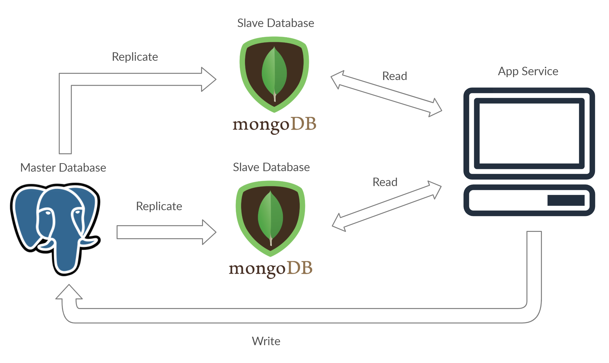

# Master-Slave architecture

- We have one master node, to which we perform write operation.
- Master node is connected with multiple slave nodes.
- If the system prefers consistency, then it will first update the master node, then perform update on slave nodes, and then mark the transaction as successful.
- Else, if the availability matters more, then it will defer the updation for some time.

!!! info ""
    - Its a Pattern 3 in [Database Scaling Pattern](../07-scaling-database/03-db-scaling-pattern.md/#pattern-3). (**Command Query Responsibility Segregation**)

---

## What if a update request comes at a slave node?

!!! success ""
    - Simply ignore the request.
    - If we are updating the db, then we need some way to propagate the updation to master node.
    - But, this architecture won't be called **Master-slave architecture**.

---

## Tip in Master-Slave Architecture

!!! tip "`Write->Master`, `Read=>Slave`"
    - Perform **write** operation to **Master node**.
    - Perform **read** operation on **Slave node**.

---

## Advantages

!!! tip ""
    - BackUP (even if master node goes down, we can still read data)
    - Scale out read operations, reduces latency
    - availability
    - reliable
    - parallelly execute multiple incoming requests (since, multiple read nodes)

---

## Different DBs for master & slave node

!!! success ""
    - We can also use different DBs for master & slave node.
    - But, in this case, we will also have to write interface.
