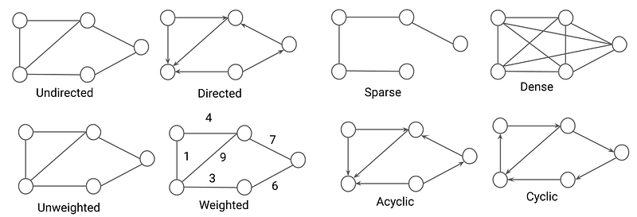
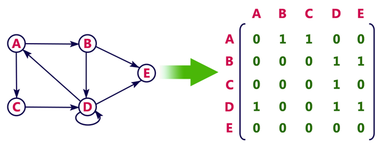
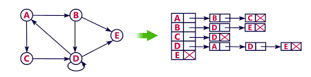

# Basic Graph concepts & Graph representation

## Terminologies


---

## Types of Graph



---

## Graph representation

### 1. Adjacency Matrix



- A matrix of (n X n) nodes, where value at `mat[i][j]` represents if the connection between the two nodes exists or not.
- If it is weighted graph & `mat[i][j]` is non-zero, it **`represents the weight of the corresponding edge`**.

### 2. Adjacency List



- An adjacency list is a 2d-array `vector<int> adjList[n]`. An array of n vectors. Each vector will represent the connected nodes.
- For weighted graph, it can be `vector<pair<int,int>> adjList[n]`. 1st item can represent the node, and 2nd item can represent the weight associated with edge.

---

## Code for graph representation

???+ danger "How the input will be passed?"
    You will be given three integers **n**, **m** and **p (a boolean integer)**, representing `no. of nodes`, `no. of edges` and `if the graph is directed (p=1) or undirected (p=0)`, respectively.

    Following that, you will be given m lines as input, and each line will have two numbers, **x** & **y**, representing an edge exists between **x** and **y**.

    All the nodes are using 0-based indexing.

    ```
    3 2 1   // 3 nodes, 2 edges & directed
    1 2     // 1 is connected to 2 (but 2 not connected with 1)
    2 0     // 2 is connected to 0
    ```

### 1. Adjacency Matrix code

!!! Code
    === "C++"

        ```cpp
        #include <iostream>
        #include <vector>
        using namespace std;

        int main()
        {
            int n, m, p;
            cin >> n >> m >> p;

            // create a 2d matrix of size
            vector<vector<int>> adj_matrix(n, vector<int>(n));

            while (m--)
            {
                int x, y;
                cin >> x >> y;

                // an edge exists between x & y
                // if it were a weighted graph, we would have used weight instead of 1
                adj_matrix[x][y] = 1;

                // if undirected, an edge exists between y & x
                if (p == 0)
                    adj_matrix[y][x] = 1;
            }

            // print the adjacency matrix
            for (int i = 0; i < n; i++)
            {
                for (int j = 0; j < n; j++)
                {
                    cout << adj_matrix[i][j] << " ";
                }
                cout << endl;
            }
        }
        ```

    === "Python"

        ```python
        print("Hello World")
        ```

### 2. Adjacency List code

!!! Code

    === "C++"

        ```cpp      
        #include <iostream>
        #include <vector>
        #include <unordered_map>
        using namespace std;

        class AdjacencyList
        {
        private:
            int num_of_nodes;
            bool is_directed;

            // for weighted graph, it can be
            // unordered_map<int, vector<pair<int,int>>> adj_list;
            unordered_map<int, vector<int>> adj_list;

        public:
            AdjacencyList(int n, bool is_directed)
            {
                this->num_of_nodes = n;
                this->is_directed = is_directed;
            }

            void add_edge(int x, int y)
            {
                // add an edge from x to y
                this->adj_list[x].push_back(y);

                // if undirected, an edge should also be from y to x
                if (this->is_directed == false)
                    this->adj_list[y].push_back(x);
            }

            void print_graph()
            {
                for (auto node : this->adj_list)
                {
                    cout << node.first << " ==> ";
                    for (auto e : node.second)
                    {
                        cout << e << ", ";
                    }
                    cout << endl;
                }
            }
        };

        int main()
        {
            int n, m, p;
            cin >> n >> m >> p;

            // create an instance of the adj_list class
            AdjacencyList adj_list = AdjacencyList(n, p);

            while (m--)
            {
                int x, y;
                cin >> x >> y;

                // add edge between x & y
                adj_list.add_edge(x, y);
            }

            // print the adjacency matrix
            adj_list.print_graph();
        }
        ```

    === "Python"

        ```python
        print("Hello World")
        ```
