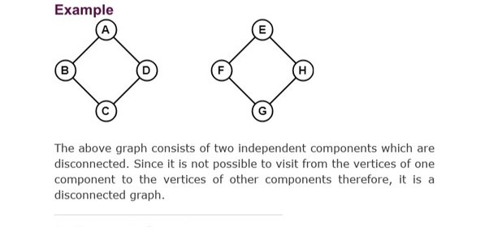

# Disconnected components in Graph



- For such disconnected graph, while doing any traversal, we need to keep track of visited nodes (use `boolean visited_node[]`).

- Iterate the non-visited nodes and traverse them (they are disconnected component of the graph).

```cpp

// let n = no. of nodes in graph
bool visited_nodes[n]={false};

for(int i=0; i<n; i++){
    if(visited_nodes[i]==false){
        // mark the node visited and then traverse it
        visited_nodes[i]=true;
        
        TRAVERSE_GRAPH_FUNCTION(node=i);
    }
}
```

!!! warning "Important"
    Always make sure to use the above piece of code, to prevent edge cases of disconnected graphs.
