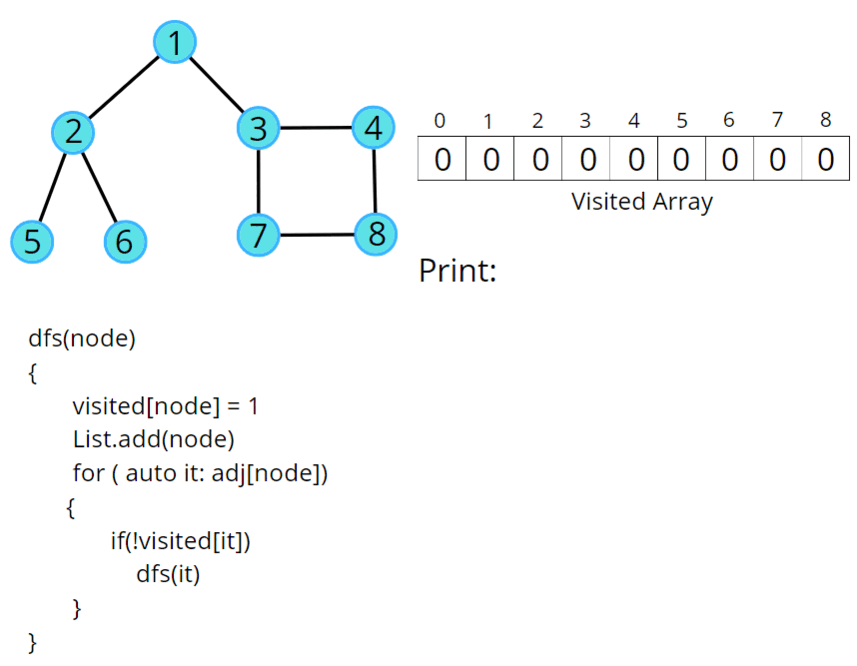

# Depth-First Search (DFS)

## Visualization


---

## BFS Vs DFS


---

## Trick to remember

!!! danger "Totka 🦹‍♂️"
    bfs queue (kyu)?

    dfs queue (kyu) nhi!

    ---

    BFS - queue ✅

    DFS - stack (or recursion) ✅

---

## DFS code (`recursive & stack`)

- Time complexity of BFS traversal is also: **`O (n + e)`**.

### Recursive Code



!!! code

    === "C++"

        ```cpp
        #include <bits/stdc++.h>
        using namespace std;

        class Solution {
        private: 
            void dfs(int node, vector<int> adj[], int vis[], vector<int> &ls) {
                vis[node] = 1; 
                ls.push_back(node); 
                // traverse all its neighbours
                for(auto it : adj[node]) {
                    // if the neighbour is not visited
                    if(!vis[it]) {
                        dfs(it, adj, vis, ls); 
                    }
                }
            }
        public:
            // Function to return a list containing the DFS traversal of the graph.
            vector<int> dfsOfGraph(int V, vector<int> adj[]) {
                int vis[V] = {0}; 

                // create a list to store dfs
                vector<int> ls; 
                // call dfs for non-visited nodes (to handle disconnected components)
                for(int i=0; i<V; i++){
                    if(vis[i]==0)
                        dfs(i, adj, vis, ls);   
                }
                return ls; 
            }
        };

        void addEdge(vector <int> adj[], int u, int v) {
            adj[u].push_back(v);
            adj[v].push_back(u);
        }

        void printAns(vector <int> &ans) {
            for (int i = 0; i < ans.size(); i++) {
                cout << ans[i] << " ";
            }
        }

        int main() 
        {
            vector <int> adj[5];
            
            addEdge(adj, 0, 2);
            addEdge(adj, 2, 4);
            addEdge(adj, 0, 1);
            addEdge(adj, 0, 3);

            Solution obj;
            vector <int> ans = obj.dfsOfGraph(5, adj);
            printAns(ans);

            return 0;
        }

        ```

    === "Python"

        ```python
        print("Hello World")
        ```

---

### Iterative code (`using stack`)

!!! code

    === "C++"

        ```cpp
        #include <bits/stdc++.h>
        using namespace std;

        class Solution {
        public:
            // Function to return Breadth First Traversal of given graph.
            vector<int> dfsOfGraph(int V, vector<int> adj[])
            {
                // V: no of vertex (nodes)

                int vis[V] = {0};

                vector<int> dfs;

                // iterate for non-visited nodes (to handle disconnected components)
                for (int currIdx = 0; currIdx < V; currIdx++)
                {
                    if (vis[currIdx] == 1)
                        continue;
                    vis[currIdx] = 1;
                    stack<int> st;
                    // push the initial starting node
                    st.push(currIdx);
                    // iterate till the queue is empty
                    while (!st.empty())
                    {
                        // get the topmost element in the queue
                        int node = st.top();
                        st.pop();
                        dfs.push_back(node);
                        // traverse for all its neighbors
                        for (auto it : adj[node])
                        {
                            // if the neighbor has previously not been visited,
                            // store in Q and mark as visited
                            if (!vis[it])
                            {
                                vis[it] = 1;
                                st.push(it);
                            }
                        }
                    }
                }
                return dfs;
            }
        };

        void addEdge(vector <int> adj[], int u, int v) {
            adj[u].push_back(v);
            adj[v].push_back(u);
        }

        void printAns(vector <int> &ans) {
            for (int i = 0; i < ans.size(); i++) {
                cout << ans[i] << " ";
            }
        }

        int main() 
        {

            vector <int> adj[6];
            
            addEdge(adj, 0, 1);
            addEdge(adj, 1, 2);
            addEdge(adj, 1, 3);
            addEdge(adj, 0, 4);
            

            Solution obj;
            vector <int> ans = obj.dfsOfGraph(5, adj);
            printAns(ans);

            return 0;
        }

        ```

    === "Python"

        ```python
        print("Hello World")
        ```
