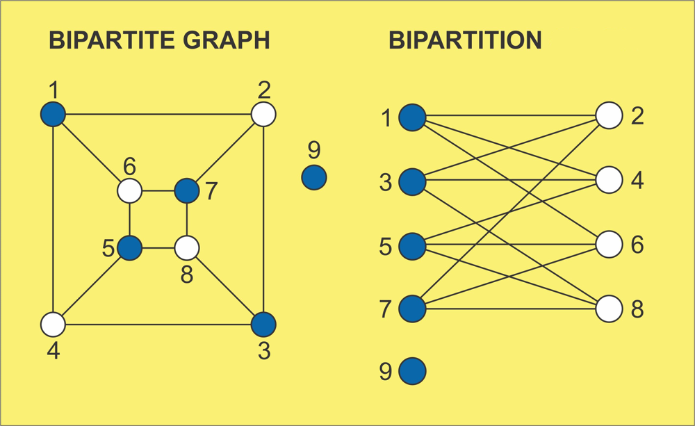

# Bipartite Graph (`partition graph in two sects`)



- Coloring graph nodes with two different colors, such that no two connected nodes have the same color.

- A graph is bipartite if the nodes can be partitioned into two independent sets A and B such that every edge in the graph connects a node in set A and a node in set B.

---

## Approach

- We will stick with our color analogy.
- Create a vector color(n,-1). {n size, color: -1}
- (-1) means no color, (0) means color1, (1) means color2.
- We will simply do BFS traversal, and if a node is not visited, it will have no color, so we will color it with (1-parent_node_col).

- If a node is already visited, then we will simply check if indeed the child node color is different from parent node or not.
- If not, means, the graph isn't **Bipartite**.

---

## Code

!!! danger "Leetcode Bipartite graph question link"
    <a href="https://leetcode.com/problems/is-graph-bipartite/" target="_blank">Leetcode Bipartite graph question link</a>

```cpp
bool isBipartite(vector<vector<int>>& graph) {
        int n=graph.size();

        // initialize color with -1.
        // -1 = no color
        // 0 = color1
        // 1 = color2
        vector<int> color(n,-1);

        // to handle disconnected components
        vector<bool> visited(n,false); 

        for(int i=0;i<n;i++){
            if(visited[i]==true)continue;

            queue<int> q;
            q.push(i);
            visited[i]=true;

            int current_col = 0;
            // we will update with (1-current_col),
            // so that it will keep oscillating in {0,1}

            color[i]=current_col;

            while(!q.empty()){
                int node = q.front();
                q.pop();

                for(auto&e: graph[node]){
                    if(visited[e]==false){
                        visited[e]=true;
                        color[e]=1-color[node];

                        q.push(e);
                    }else{
                        if(color[e]==color[node]){return false;}
                    }
                }
            }

        }
        return true;

    }
```