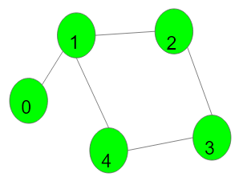

# Cycle detection in Undirected Graph (BFS & DFS)



- Simply check if a node is not already visited.
- If it's already visited, just check if it's not the parent of the node (that called it).
- If it's not, it is indeed a cyclic undirected graph.

!!! danger "Question link"
    <a href="https://www.naukri.com/code360/problems/cycle-detection-in-undirected-graph_1062670" target="_blank">Code Studio question link</a>
---

## BFS code

```cpp
bool bfs_cycle_detection( vector<int> adj_list[], int n){
    bool visited[n];
    for(auto &e:visited)e=false;
    unordered_map<int,int> parent;

    for(int i=0;i<n;i++){
        if(visited[i]==true)continue;

        queue<int> q;
        q.push(i);
        visited[i]=true;
        parent[i]=-1;

        while(!q.empty()){
            int node = q.front();
            q.pop();
            for(auto &e: adj_list[node]){
                if(visited[e]==false){
                    visited[e]=true;
                    q.push(e);
                    parent[e]=node;
                }
                else if(parent[node]==e){
                    continue;
                }
                else{
                    // current node is already visited, and it's not the parent of node.
                    // means, cycle exists
                    return true;
                }
            }
        }
    }
    return false;
}
```

---

## DFS code (recursive)

```cpp
bool dfs_is_visited_and_not_parent(vector<int> adj_list[], int n, int curr, int parent, bool visited[]){
    visited[curr]=true;

    for(auto &e:adj_list[curr]){
        if(visited[e]==false){
            bool return_val = dfs_is_visited_and_not_parent(adj_list, n, e, curr, visited);
            if(return_val==true)return true;
        }
        else if(e == parent)continue;
        else{
            // already visited and is not parent
            // means, cyclic undirected graph
            return true;
        }
    }
    return false;
}

bool dfs_cycle_detection_recursion(vector<int> adj_list[], int n){
    bool visited[n];
    for(auto &e:visited)e=false;

    // handling disconnected components
    for(int i=0; i<n; i++){
        if(visited[i]==true)continue;

        bool return_val = dfs_is_visited_and_not_parent(adj_list,n,i,-1,visited);
        if(return_val==true)return true;
    }
    return false;
}
```

---

## DFS code (iterative `stack`)

```cpp
bool dfs_cycle_detection_iterative(vector<int> adj_list[], int n){
    bool visited[n];
    for(auto &e:visited)e=false;

    unordered_map<int,int> parent;

    // handling disconnected components
    for(int i=0; i<n; i++){
        if(visited[i]==true)continue;

        parent[i]=-1;
        stack<int> st;
        st.push(i);
        visited[i]=true;

        while(!st.empty()){
            int node = st.top();
            st.pop();

            for(auto &e:adj_list[node]){
                if(visited[e]==false){
                    visited[e]=true;
                    parent[e]=node;
                    st.push(e);
                }
                else if(parent[node]==e)continue;
                else{
                    // current node already visited, and is not the parent of node.
                    // means cyclic undirected graph
                    return true; 
                }
            }
        }
    }
    return false;
}

```
