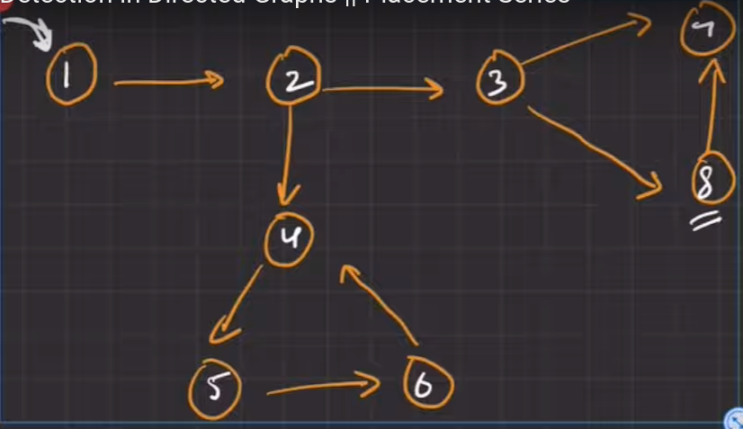

# Cycle detection in Directed Graph (DFS)


---

## Why can't we use the same algorithm as in undirected graph?



???+ warning "Explanation"
    Look at (3,4,8) section.

    First, we will visit 3, and mark it as visited.
    Then, we will go to 4, and mark it as visited.
    We will return back to 3, and go to 8, and mark it as visited.
    Now, 8 will try to visit 4, but it's already visited, and 4 is not the parent of 8.
    So, our algorithm will conclude a cycle is present.

    But, actually it's not (in {3,4,8}).


    > So, what went wrong?
    >
    > We're not reaching to 8 by following the same path in which 8 was earlier found.
    > To account for this, we need to create a `dfs_visited` array, that will store the visited nodes in the current paths.

---

## Hint 🥂

- We need to create an extra **`dfs_visited[n]`** array to keep track of visited nodes in the current path.

---
## Code

```cpp

bool dfs_recursive_cyclic(vector<int> adj_list[], int n, bool visited[], bool dfs_visited[], int node){
  visited[node]=true;
  dfs_visited[node]=true;

  for(auto&e:adj_list[node]){
    if(visited[e]==false){
      bool return_val = dfs_recursive_cyclic(adj_list, n, visited, dfs_visited,e);
      if(return_val==true)return true;
    }
    else if(dfs_visited[e]==true){
      return true;
    }
  }
  dfs_visited[node]=false;
  return false;
}

int detectCycleInDirectedGraph(int n, vector < pair < int, int >> & edges) {
  // Write your code here.
  vector<int> adj_list[n+1];
  for(auto &e:edges){
    int x= e.first;
    int y= e.second;
    adj_list[x].push_back(y);
  }

  bool visited[n+1]={false};

  for(int i=0;i<n;i++){
    if(visited[i]==true)continue;
    bool dfs_visited[n+1]={false};
    bool return_val = dfs_recursive_cyclic(adj_list, n+1, visited, dfs_visited,i);
    if(return_val==true)return true;
  }
  return false;

}
```
