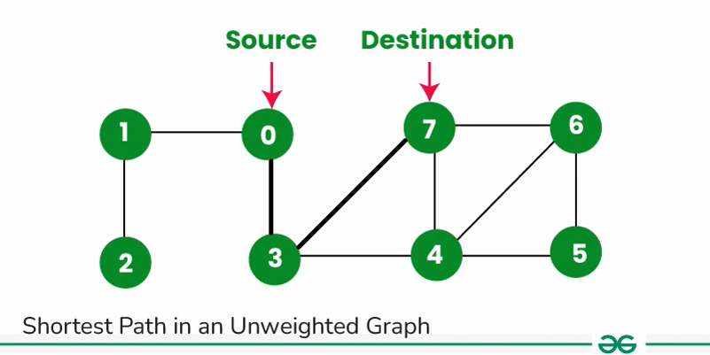

# Shortest path in Undirected graph

- In undirected graph, shortest path can be easily found via **BFS (breadth-first-search)**.
- If you want to get the no. of steps, you can simply do so by keeping track of number of steps taken from source (queue length after traversing all the child/connected nodes).
- If you need the shortest **path**, we can easily do so by just creating a **`parent map`**, that stores the parent of each node.
- **`Backtrack from target node to source node using the parent map`**.



---

!!! danger "Code studio: Shortest path in an unweighted graph"
    <a href="https://www.naukri.com/code360/problems/shortest-path-in-an-unweighted-graph_981297" target="_blank">CodeStudio: Shortest path in an unweighted graph</a>

```cpp
# include <unordered_map>
vector<int> shortestPath(vector<pair<int, int>> edges, int n, int m, int s,
                         int t) {


  // Write your code here
  vector<int> adj_list[n + 1];
  for (auto &e : edges) {
    int x = e.first, y = e.second;

    adj_list[x].push_back(y);
    adj_list[y].push_back(x);
  }

  bool visited[n + 1]; 
  // we only need it to check if a node is visited, not for disconnected component.
  // as src is fixed.

  for (auto &e : visited)
    e = false;

  unordered_map<int, int> parent;

  // source is visited, and its parent is -1.
  visited[s] = true;
  parent[s] = -1; // no parent


  queue<int> q;
  q.push(s);

  while (!q.empty()) {
    int node = q.front();
    q.pop();

    for (auto &e : adj_list[node]) {
      if (visited[e] == false) {
        visited[e] = true;
        q.push(e);
        parent[e] = node;
      }
    }
  }

  // walk back from destination to source
  // in end, we will reverse the vector
  int curr_node = t;
  vector<int> ans;

  while (curr_node!=-1 && curr_node!=s) {
	//   cout<<"curr_node: "<<curr_node<<endl;
	  ans.push_back(curr_node);
	  curr_node = parent[curr_node];

  }
  	if(curr_node==s)ans.push_back(curr_node);
		reverse(ans.begin(),ans.end());
		return ans;
}

```