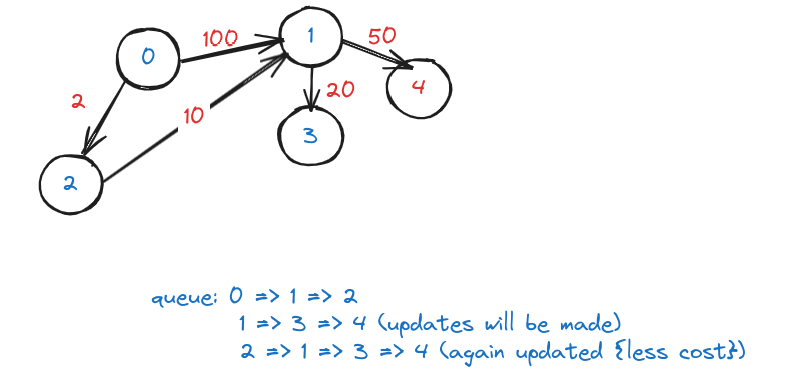

# Dijkstra's Algorithm

- **Use `priority queue`**.
- Time complexity: O(E *log(V))
    - `E: number of edges;`
    - `V: number of vertices`

## Code

!!! danger "Codestudio question: Dijkstra's shortest path"
    <a href="https://www.naukri.com/code360/problems/dijkstra-s-shortest-path_920469" target="_blank">Shortest path in Directed Acyclic Graph
    </a>

```cpp
vector<int> shortestPath(int N,int M, vector<vector<int>>& edges){
        // code here
        vector<pair<int,int>> adj[N];
        for(auto &e:edges){
            int x=e[0], y=e[1], w=e[2];
            
            adj[x].push_back({y,w});
        }
        
        
        vector<int> ans(N,-1);
        ans[0]=0;
        
        priority_queue<int> q;
        q.push(0);
        
        while(!q.empty()){
            int node = q.top();
            q.pop();
            
            for(auto&e:adj[node]){
                if(ans[e.first]==-1){
                    ans[e.first]=ans[node]+e.second;
                    q.push(e.first);
                }else if(ans[e.first]>ans[node]+e.second){
                    ans[e.first]=ans[node]+e.second;
                    q.push(e.first);
                }
            }
        }
        
        return ans;
    }
```

---

## Why `priority queue` is preferred over `queue`?



- If (node: 1) was connected with 100s of nodes, all of them were to be updated twice, and this happened simply bcoz, queue traverses in FIFO orders and doesn't cares about distance.

- If we would have used **priority queue**, it would have given more preference to the shorter distant node, and we would have prevented unnecessary updation.

---

## Using `Set` instead of `priority queue`

- We can also **Set** instead of **Priority queue**.
- Set stores data in sorted order.
- But, when we will find if a shorter distance to a node exists, we would be required to delete that from the set.
- The **performance gain is not significant**.

---

## Time complexity ⏲️

!!! info
    - Time complexity: **O(E *log(V))**
        - `E: number of edges;`
        - `V: number of vertices`

???+ warning "Explanation"
    - In worst case, all vertices of graph will be connected to each other.
    - So, **E = V * (V-1) = V^2**
    - Now, we need to traverse the graph through edge, so complexity `O(V^2)`.
    - And, while traversing, we also need to insert in priority queue or do some operations.
    - In worst case, we will push all the edges `(weight,node,parent)`, so time complexity: `O(log(V^2))`.

    > So, overall complexity is:
    > 
    > = O(V^2 * log(V^2))
    > 
    > = O(V^2 * 2*log(V)) # log properties
    > 
    > = O(E * log(V)) # since, E = V^2
