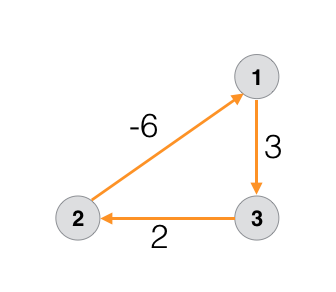

# Bellman-Ford algorithm

!!! success "`Bellman-ford` V/s `Dijkstra`"
    - Dijkstra's algorithm doesn't works for graphs containing **negative weights**.
    - Dijkstra can't detect negative cycles and will stuck in the loop forever.
    - **Bellman-ford algorithm** will tackle these shortcomings, but will have more time complexity.

- single source shortest path algorithm
- can work with negative weights
- and can also detect negative cycles.

---

## Idea 🤔

- The Bellman-Ford algorithm’s primary principle is that it starts with a single source and calculates the distance to each node.

- The distance is initially unknown and assumed to be infinite, but as time goes on, the algorithm relaxes those paths by identifying a few shorter paths.

- Hence it is said that Bellman-Ford is based on **`Principle of Relaxation`**.

- Iterate through all the edges for **(n-1) times**, do relaxation.

- To detect negative cycle, iterate for the one last time **(n time)**, and if a single relaxation is possible, means the graph contains negative cycles, and hence shortest distance can't be found.

---

## What is relaxation in Bellman-ford algorithm?

```cpp
// dist[] <= distance of nodes from a source node
// if there's an edge from x to y, and the dist can be reduced, do it.
// this is called relaxation.
if (dist[x]+wt < dist[y]){
    dist[y]=dist[x]+wt;
}

```

---

## Why iterate for **(n-1) times**?

- In the worst case, for a graph with **n nodes**, the farthest node from source node can be at the **(n-1 edge)** (if they are in one component).
- So, if we have iterated for (n-1) times and did the relaxation, we can be sure that we have covered the worst case. Now, either some nodes will be in another component (which can't be visited from source node), or a negative cycle will be present in the graph.


- If the other nodes are in another component, then again no updation in the distance array will happen.
- But, if the graph have negative cycle, our distance array will again be updated (in other words, relaxation condition will be true).



- So, when we are iterating through all the edges for the **nth time**, a single relaxation condition is sufficient to indicate the graph contains **negative cycle**.

---

## Code

```cpp
	/*  Function to implement Bellman Ford
	*   edges: vector of vectors which represents the graph edge (node1, node2, weight)
	*   S: source vertex to start traversing graph with
	*   V: number of vertices
	*/
	vector<int> bellman_ford(int V, vector<vector<int>>& edges, int S) {
		vector<int> dist(V, 1e8);
		dist[S] = 0;
		for (int i = 0; i < V - 1; i++) {
			for (auto it : edges) {
				int u = it[0];
				int v = it[1];
				int wt = it[2];
				if (dist[u] != 1e8 && dist[u] + wt < dist[v]) {
					dist[v] = dist[u] + wt;
				}
			}
		}
		// Nth relaxation to check negative cycle
		for (auto it : edges) {
			int u = it[0];
			int v = it[1];
			int wt = it[2];
			if (dist[u] != 1e8 && dist[u] + wt < dist[v]) {
				return { -1};
			}
		}

		return dist;
	}

```

---

## Time complexity 🕥

- Since, we're iterating through all the edges for (n-1) times, so complexity:

- (n-1) is roughly same as n, which is number of vertices (V).


---

## Dijkstra Vs Bellman-ford

!!! info "Time complexity of Dijkstra & Bellman-ford"
    - Dijkstra's time complexity is: O(E*log(V))
    - Bellman-ford's time complexity is: O(E*V)

    ---

    So obviously, Dijkstra is more efficient,

    - but can't handle negative weights 
    - & if a negative cycle is present, it will be stuck in the loop forever.

    ---

    Bellman-ford is more time-consuming,
    
    - but, can handle negative weights
    - and will be able to detect negative cycle.
