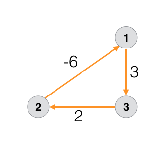

# Floyd-Warshall algorithm

- **Multi-source shortest path algorithm**
- **Can detect negative cycles**

It is used to calculate the shortest path from each node to another node.

---

## Algorithm

1. We'll create a adjacency matrix representation of the graph.
2. Each cell with index {i,j} will represent distance from `node i` to `node j`.
3. We'll initialize the matrix with a very large number (`1e9 or INT_MAX`).
4. Update all the diagonal elements to be 0. `mat[i][i]=0`. Since to go from node-0 to node-0, distance will be 0.
5. Now, traverse all the edges and update the matrix accordingly.
6. Once done, now the matrix contains distance by direct route (from i to j). Now, we will follow the **intermediate approach**.
7. Instead of directly going from node-i to node-j, we will go via node-k. So, `new_dist=node[i][k]+node[k][j]`. And, if this new distance is smaller than the existing distance, we will update it.
8. **`For k, we will start from 0 and go till last node (n-1)`**.
9. In the end, our matrix with cell {i,j} will contain shortest distance from node-i to node-j.
10. To detect if the graph contains **negative cycle**, simply check if diagonal element are non-zero. If they are, the graph contains a `negative cycle`.



This is so because, we initialized the diagonals with 0, and our graph started traversing from some node and reached back to itself with negative weight, means, negative cycle.

---

## Code

!!! danger "GFG Floyd-Warshall algorithm question link"
    <a href="https://www.geeksforgeeks.org/problems/implementing-floyd-warshall2042/1" target="_blank">GFG Floyd-Warshall algorithm question link</a>

```cpp
class Solution {
  public:
	void shortest_distance(vector<vector<int>>&matrix){
	    // Code here
	    int n = matrix.size();
	    
	    for(int k=0;k<n;k++){
	        for(int i=0;i<n;i++){
	            for(int j=0;j<n;j++){
	                int dist_ij = matrix[i][j];
	                int dist_ik = matrix[i][k];
	                int dist_kj = matrix[k][j];
	                
	                // if there exists a route from {i => k => j}
	                if(dist_ik!=-1 && dist_kj!=-1){
	                    
	                    // if no route b/w {i=>j} or smaller distance through k
	                    if(dist_ij==-1 || (dist_ij > dist_ik + dist_kj)){
	                        matrix[i][j] = dist_ik+dist_kj;
	                    }
	                }
	            }
	        }
	    }

        // if we were required to check if the graph contains negative cycle,
        // simply check if diagonals are non-zero (negative mainly).
        //
        // for(int i=0;i<n;i++)
            // if(matrix[i][i]<0)
                    // cout<<"Graph contains negative cycle"<<endl;
	}
};
```

---

## Another Leetcode medium problem

!!! bug "Leetcode Floyd-warshall algorithm problem"
    <a href="https://leetcode.com/problems/find-the-city-with-the-smallest-number-of-neighbors-at-a-threshold-distance/description/" target="_blank">Find the city with the smallest number of neighbors at a threshold distance</a>

---

## Check if graph contains negative cycle

- If we were required to check if the graph contains negative cycle,
- simply check if diagonals are non-zero (negative mainly).

```cpp
for(int i=0;i<n;i++)
    if(matrix[i][i]<0)
        cout<<"Graph contains negative cycle"<<endl;
```

---

## Time complexity ⏲️

- Time complexity of Floyd-Warshall algorithm is: **`O(V^3)`**

!!! info
    Since we're travelling through all the intermediate nodes and from each node to another node, time complexity is:

    - O(n^3) // or we could say O(V^3)

    - If instead of using floyd-warshall algorithm, we have used **Dijkstra's algorithm** for each node as source node, time complexity would have been:

    - O(V) * O(E* log(V)) // time-complexity of dijkstra * no. of nodes

!!! danger "`Dijkstra` V/s `Floyd-Warshall` algorithm"
    - So, **Dijkstra** with each node as source node, will have better time-complexity than **floyd-warshall** algorithm.
    - But, **`Dijkstra`** will be stuck in forever loop if the graph contains **negative cycles** and it won't be useful if the graph contains `negative weights`.
    - So, for such situations, **Floyd-Warshall** will be preferred.
  