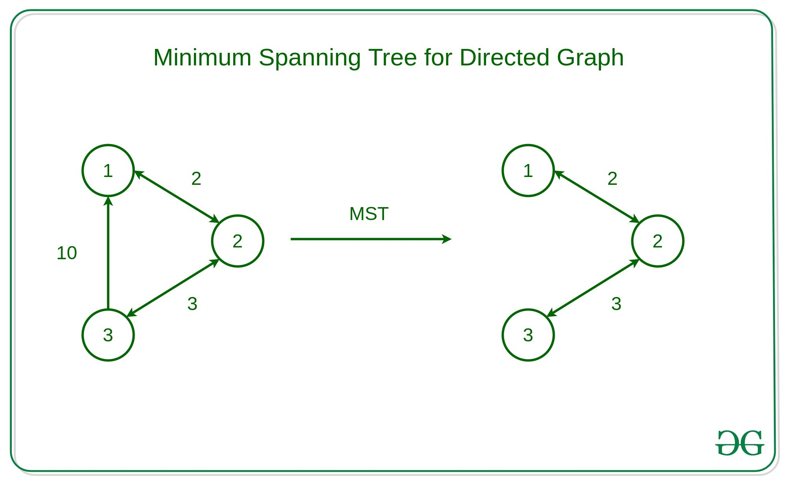

# Kruskal's algorithm (`Minimum spanning tree using Disjoint Set`)



- To find `Minimum spanning tree (MST)` using **Kruskal's algorithm**, we use **Disjoint Set**.

---

## Important point regarding `Disjoint Set`

Disjoint set provides two important functions:

- **findUPar()** => function helps to find the ultimate parent of a particular node
- **Union** => basically helps to add the edges between two nodes

---

## Approach

- First, we need to extract the edge information(if not given already) from the given adjacency list in the format of (wt, u, v) where u is the current node, v is the adjacent node and wt is the weight of the edge between node u and v and we will store the tuples in an array.

- Then the **`array must be sorted in the ascending order of the weights`** so that while iterating we can get the edges with the minimum weights first.

- After that, we will iterate over the edge information, and for each tuple, we will apply the  following operation:

!!! success "algorithm: "
    - First, we will take the two nodes `u` and `v` from the tuple and check if the ultimate parents of both nodes are the same or not using the **`findUPar()`** function provided by the Disjoint Set data structure.
    - **If the ultimate parents are the same, we need not do anything to that edge as there already exists a path between the nodes and we will continue to the next tuple.**
    - If the ultimate parents are different, we will add the weight of the edge to our final answer(i.e. mstWt variable used in the following code) and apply the union operation(i.e. either **`unionBySize(u, v)`** or **`unionByRank(u, v)`**) with the nodes `u` and `v`. The union operation is also provided by the Disjoint Set.

Finally, we will get our answer (in the mstWt variable as used in the following code) successfully.


---

## Code

```cpp
#include <bits/stdc++.h>
using namespace std;


class DisjointSet {
    vector<int> rank, parent;
public:
    DisjointSet(int n) {
        rank.resize(n, 0);
        parent.resize(n);
        for (int i = 0; i < n; i++) {
            parent[i] = i;
        }
    }

    int findUPar(int node) {
        if (node == parent[node])
            return node;
        return parent[node] = findUPar(parent[node]);
    }

    void unionByRank(int u, int v) {
        int ulp_u = findUPar(u);
        int ulp_v = findUPar(v);
        if (ulp_u == ulp_v) return;
        if (rank[ulp_u] < rank[ulp_v]) {
            parent[ulp_u] = ulp_v;
        }
        else if (rank[ulp_v] < rank[ulp_u]) {
            parent[ulp_v] = ulp_u;
        }
        else {
            parent[ulp_v] = ulp_u;
            rank[ulp_u]++;
        }
    }
};

class Solution
{
public:
    //Function to find sum of weights of edges of the Minimum Spanning Tree.
    int spanningTree(int V, vector<vector<int>> adj[])
    {
        // 1 - 2 wt = 5
        /// 1 - > (2, 5)
        // 2 -> (1, 5)

        // 5, 1, 2
        // 5, 2, 1
        vector<pair<int, pair<int, int>>> edges;
        for (int i = 0; i < V; i++) {
            for (auto it : adj[i]) {
                int adjNode = it[0];
                int wt = it[1];
                int node = i;

                edges.push_back({wt, {node, adjNode}});
            }
        }
        DisjointSet ds(V);
        sort(edges.begin(), edges.end());

        int mstWt = 0;
        for (auto it : edges) {
            int wt = it.first;
            int u = it.second.first;
            int v = it.second.second;

            if (ds.findUPar(u) != ds.findUPar(v)) {
                mstWt += wt;
                ds.unionBySize(u, v);
            }
        }

        return mstWt;
    }
};
```