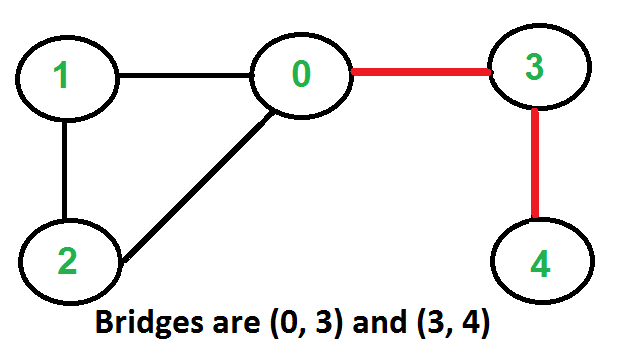
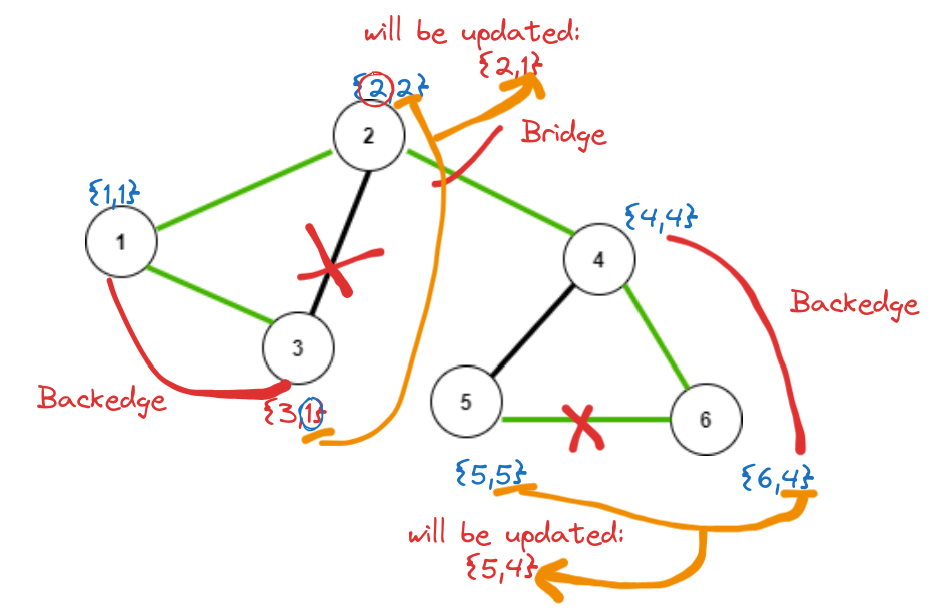

# Bridges in Graph (`Tarjan's algorithm`)



- Any edge in a component of a graph is called a bridge when the component is divided into two or more components if we remove that particular edge.

---

## Approach

- We will create two arrays: `time_of_insertion` & `lowest_time_of_insertion`.

!!! quote ""
    **Time of insertion**: Dring the DFS call, the time when a node is visited, is called its time of insertion.

    > For example, if in a graph, we start DFS from node 1 it will visit node 1 first then node 2, node 3, node 4, and so on. So, the time of insertion for node 1 will be 1, node 2 will be 2, node 3 will be 3 and it will continue like this. 

    **Lowest time of insertion**: In this case, the **current node refers to all its adjacent nodes except the parent and takes the minimum lowest time of insertion into account, and updates its `minimum time`**.

- Now, if `lowest_time_of_insertion` of a child node is smaller than `time_of_insertion` of parent node, means, there exists a **back-edge** from child node to parent node's parents. So, the `child node` and `parent node` are not connected by a **Bridge**.

- Else, that connection edge is a **Bridge**.

!!! tip "Condition for the edge to be *Bridge*"
    - p <= parent node
    - u <= child node

    ```cpp
    if (lowest_time_of_insertion[u] > time_of_insertion[p]){
        cout<<"The connection is a bridge"<<endl;
    }
    ```

---

## Explanation of the condition

???+ example "Why does the condition matters and how can one say so?"
    

    - In case, a back-edge is present, then, lowest_time_of_insertion will be reduced, denoting we can reach it following another smaller path too. (Since, we're using DFS, so we have come depth, and not breadth.)
    - Then, when we compare it with a node with some `time_of_insertion`, we check, if the `time to reach` node is greater than `lowest time to reach child node`. If it is, means, backedge was present. So, `no bridge`.
    - Else, that edge connection is `bridge`.


!!! bug "Note: "
    We are not considering the parent’s insertion time during calculating the lowest insertion time as we want to check if any other path from the node to the parent exists excluding the edge we intend to remove.

---

## Code

!!! danger "Leetcode **Hard** bridges in a graph question link"
    <a href="https://leetcode.com/problems/critical-connections-in-a-network/description/" target="_blank">Critical connections in a network</a>

```cpp
class Solution {
public:
    void modified_dfs(int n, vector<int> adj[],
        vector<int> &time_of_insertion,
        vector<int> &lowest_time_of_insertion,
        vector<bool> &visited, int node, int parent, int &counter, vector<vector<int>>&ans){
            
            visited[node]=true;
            time_of_insertion[node] = counter;
            lowest_time_of_insertion[node] = counter;
            counter++;
            
            for(auto&e:adj[node]){
                if(visited[e]==false){
                    modified_dfs(
                        n, adj,
                        time_of_insertion,
                        lowest_time_of_insertion,
                        visited, e, node, counter,ans
                    );
                    // update lowest_time_of_insertion
                    lowest_time_of_insertion[node]=min(lowest_time_of_insertion[node],lowest_time_of_insertion[e]);
                    // bridge condition
                    if(lowest_time_of_insertion[e] > time_of_insertion[node]){
                        ans.push_back({node, e});
                    }
                }
                else if(e!=parent){
                    // if e- visited, but not parent; means `backedge`
                    // update lowest_time_of_insertion
                    lowest_time_of_insertion[node]=min(lowest_time_of_insertion[node],lowest_time_of_insertion[e]);
                    // // bridge condition
                    if(lowest_time_of_insertion[e] > time_of_insertion[node]){
                        ans.push_back({node, e});
                    }
                }     
            }
        
    }

    vector<vector<int>> criticalConnections(int n, vector<vector<int>>& connections) {
        vector<int> time_of_insertion(n,-1), lowest_time_of_insertion(n,-1);

        vector<bool> visited(n,false);
        vector<vector<int>> ans;

        vector<int> adj[n];
        for(auto&e:connections){
            int x = e[0], y = e[1];
            adj[x].push_back(y);
            adj[y].push_back(x);
        }

        int counter = 0;
        int node = 0, parent = -1;
        modified_dfs(
                        n, adj,
                        time_of_insertion,
                        lowest_time_of_insertion,
                        visited, node, parent, counter,ans
                    );

        return ans;
    }
};
```

---

## Time & Space complexity

!!! example "Time complexity"
    O(V+2E), where V = no. of vertices, E = no. of edges. It is because the algorithm is just a simple DFS traversal.

!!! example "Space complexity"
    O(V+2E) + O(3V), where V = no. of vertices, E = no. of edges. O(V+2E) to store the graph in an adjacency list and O(3V) for the three arrays i.e. tin, low, and vis, each of size V.
