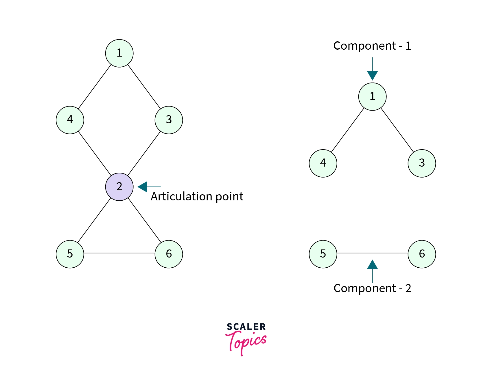
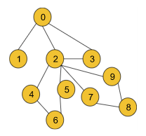

# Articulation point in Graph



- Articulation Points of a graph are the nodes on whose removal, the graph breaks into multiple components. 

---

## Video link

!!! danger "Striver video link for articulation point"
    <a href="https://www.youtube.com/watch?v=j1QDfU21iZk" target="_blank">Striver video: Articulation Point</a>

---

## Approach

- Approach to find **`Articulation point`** is similar to **`Bridges in graph`**.
- We will have a vector `time_inserted`, similar to `bridges in graph`.
- Another vector `lowest_node_it_can_reach`, that stores the lowest node a node can reach.
- Once dfs traversal is done for a node's all adjacent nodes, we update `lowest_node_it_can_reach` for the node to be minimum of its current value & value of all adjacent nodes.
- For a node to be articulation point, if `time_inserted[node] <= lowest_node_it_can_reach[child_node]`. It means, child_node couldn't reach someone in the prior of the node.
- The above algorithm is valid only for non-root nodes.
- For the root node with parent (-1), we simply need to count `number of independent (non-visited) children`. If multiple nodes are connected, they all will be traversed in DFS.

---

## Tip

- Same node can be articulation point for multiple DFS traversals.
- So, better to use `set` for storing all the articulation points.



- While checking for node 2, we will get the node as the articulation point once for the first component that contains nodes 4, 5, and 6 and we will again get the same node 2 for the second component that includes the nodes 7, 8, and 9.

---

## Code

!!! danger "GFG Articulation Point in a graph question link"
    <a href="https://www.geeksforgeeks.org/problems/articulation-point-1/1" target="_blank">Articulation Point</a>

```cpp
#include <bits/stdc++.h>
using namespace std;

//User function Template for C++

class Solution {
private:
    void dfs(int node, int parent, vector<int> &vis, int tin[], int low[],
             vector<int> &mark, vector<int>adj[], int timer) {
        vis[node] = 1;
        tin[node] = low[node] = timer;
        timer++;
        int child = 0;
        for (auto it : adj[node]) {
            if (it == parent) continue;
            if (!vis[it]) {
                dfs(it, node, vis, tin, low, mark, adj, timer);
                low[node] = min(low[node], low[it]);
                if (low[it] >= tin[node] && parent != -1) {
                    mark[node] = 1;
                }
                child++;
            }
            else {
                // if already visited, then, low = the node number
                // unlike, `bridge in graph`, we're not doing: low[node] = min(low[node], low[it]);
                low[node] = min(low[node], tin[it]);
            }
        }
        if (child > 1 && parent == -1) {
            mark[node] = 1;
        }
    }
public:
    vector<int> articulationPoints(int n, vector<int>adj[]) {
        vector<int> vis(n, 0);
        int tin[n]; // time_inserted
        int low[n]; // lowest node it can reach
        vector<int> mark(n, 0);
        int timer = 1;

        for (int i = 0; i < n; i++) {
            if (!vis[i]) {
                dfs(i, -1, vis, tin, low, mark, adj, timer);
            }
        }
        vector<int> ans;
        for (int i = 0; i < n; i++) {
            if (mark[i] == 1) {
                ans.push_back(i);
            }
        }
        if (ans.size() == 0) return { -1};
        return ans;
    }
};
```

---

## Time & Space complexity

!!! example "Time complexity"
    O(V+2E), where V = no. of vertices, E = no. of edges. It is because the algorithm is just a simple DFS traversal.

!!! example "Space complexity"
    O(3V), where V = no. of vertices. O(3V) is for the three arrays i.e. tin, low, and vis, each of size V.
