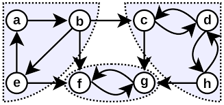
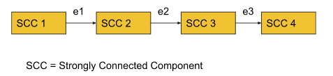
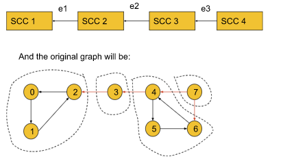

# Strongly Connected Components (SCC) & Kosaraju's algorithm



---

## Strongly connected components (SCC)

A component is called a Strongly Connected Component(SCC) only if for every possible pair of vertices (u, v) inside that component, u is reachable from v and v is reachable from u.


- By definition, a component containing a single vertex is always a strongly connected component. For that vertex 3 in the above graph is itself a strongly connected component.

- the above graph contains 4 strongly connected components like (0,1,2), (3), (4,5,6), and (7).

---

## Kosaraju's Algorithm intuition

- SCC means, you can reach from any node within scc to any other in scc.


- If we do dfs traversal for a graph, it should be something like, moving from one scc to another scc.



- By definition, within each SCC, every node is reachable. So, if we start DFS from a node of SCC1 we can visit all the nodes in SCC1 and via edge e1 we can reach SCC2. Similarly, we can travel from SCC2 to SCC3 via e2 and SCC3 to SCC4 via e3. Thus all the nodes of the graph become reachable.

- But if we reverse the edges e1, e2, and e3, the graph will look like the following:



- After reversing all the edges, we will still be able to do dfs within SCC, as they are all strongly connected, but we can't go from one scc to another scc.

- Now in this graph, if we start DFS from node 0 it will visit only the nodes of SCC1. Similarly, if we start from node 3 it will visit only the nodes of SCC2. Thus, by reversing the SCC-connecting edges, the adjacent SCCs become unreachable. Now, the DFS will work in such a way, that in one DFS call we can only visit the nodes of a particular SCC. 

- So, the **number of DFS calls will represent the number of SCCs**.

- One problem may arise if we don't have clue about starting node:

!!! info ""
    Now, the question might be like,
    
    

    if node 0 is located in SCC4 and we start DFS from node 0, again we will visit all the SCCs at once even after reversing the edges. This is where the `starting time and the finishing time concept will come in`.

---

## Algorithm

- Sort all the nodes according to their finishing time:
!!! info ""
    To sort all the nodes according to their finishing time, we will start **`DFS from node 0`** and while backtracking in the DFS call we will store the nodes in a **stack** data structure. The nodes in the last SCC will finish first and will be stored in the last of the stack. After the DFS gets completed for all the nodes, the stack will be storing all the nodes in the sorted order of their finishing time.

- Reverse all the edges of the entire graph:
!!! info ""
    Now, we will **create another adjacency list and store the information of the graph in a reversed manner**.

- Perform the DFS and count the no. of different DFS calls to get the no. of SCC:
!!! info ""
    Now, we will start DFS from the node which is on the top of the stack and continue until the stack becomes empty. **For each individual DFS call, we will increment the counter variable by 1**.

    We will **`get the number of SCCs by just counting the number of individual DFS calls as in each individual DFS call`**, all the nodes of a particular SCC get visited.

- Finally, we will get the number of SCCs in the counter variable. If we want to store the SCCs as well, we need to store the nodes in some array during each individual DFS call in step 3.

---

## Reiterate

!!! success "Steps"
    - The first step is to know, from which node we should start the DFS call.
    - The second step is to make adjacent SCCs unreachable and to limit the DFS traversal in such a way, that in each DFS call, all the nodes of a particular SCC get visited.
    - The third step is to get the numbers of the SCCs. In this step, we can also store the nodes of each SCC if we want to do so.

!!! warning "Note"
    The sorting of the nodes according to their finishing time is very important. By performing this step, we will get to know where we should start our DFS calls.

    - The top-most element of the stack will finish last and it will surely belong to the SCC1. So, the sorting step is important for the algorithm.

---

## Code

!!! danger "GFG SCC Kosaraju's algorithm question link"
    <a href="https://www.geeksforgeeks.org/problems/strongly-connected-components-kosarajus-algo/1" target="_blank">GFG SCC Kosaraju's algorithm question link</a>


```cpp
#include <bits/stdc++.h>
using namespace std;


class Solution
{
private:
    void dfs(int node, vector<int> &vis, vector<int> adj[],
             stack<int> &st) {
        vis[node] = 1;
        for (auto it : adj[node]) {
            if (!vis[it]) {
                dfs(it, vis, adj, st);
            }
        }

        st.push(node);
    }

    void dfs3(int node, vector<int> &vis, vector<int> adjT[]) {
        vis[node] = 1;
        for (auto it : adjT[node]) {
            if (!vis[it]) {
                dfs3(it, vis, adjT);
            }
        }
    }
public:
    //Function to find number of strongly connected components in the graph.
    int kosaraju(int V, vector<int> adj[])
    {
        vector<int> vis(V, 0);
        stack<int> st;
        for (int i = 0; i < V; i++) {
            if (!vis[i]) {
                dfs(i, vis, adj, st);
            }
        }

        vector<int> adjT[V];
        for (int i = 0; i < V; i++) {
            vis[i] = 0;
            for (auto it : adj[i]) {
                // i -> it
                // it -> i
                adjT[it].push_back(i);
            }
        }
        int scc = 0;
        while (!st.empty()) {
            int node = st.top();
            st.pop();
            if (!vis[node]) {
                scc++;
                dfs3(node, vis, adjT);
            }
        }
        return scc;
    }
};
```

---

## Time & Space complexity

!!! example "Time Complexity"
    O(V+E) + O(V+E) + O(V+E) ~ O(V+E) , where V = no. of vertices, E = no. of edges. The first step is a simple DFS, so the first term is O(V+E).

    - The second step of reversing the graph and the third step, containing DFS again, will take O(V+E) each.

!!! example "Space Complexity"
    O(V)+O(V)+O(V+E), where V = no. of vertices, E = no. of edges. Two O(V) for the visited array and the stack we have used.

    - O(V+E) space for the reversed adjacent list.

