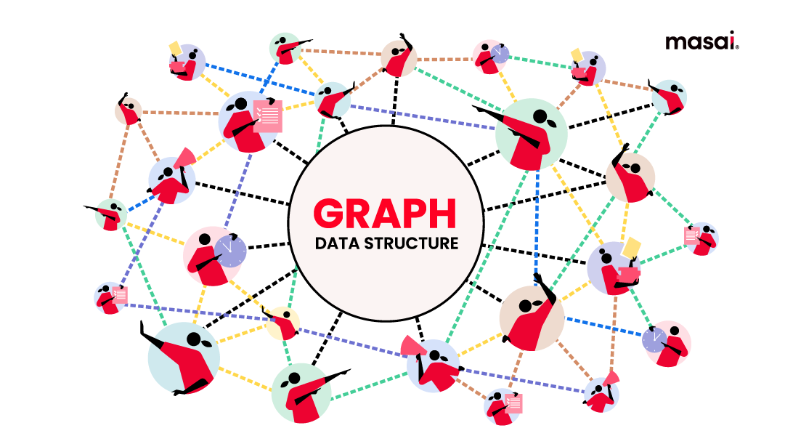

# Graph

---

## Contents

1. Introduction, BFS & DFS:
    - [Basic Concepts & representation](./01-intro-bfs-dfs/01-introduction.md)
    - [Disconnected components](./01-intro-bfs-dfs/02-disconnected-components.md)
    - [Breadth-first-search (BFS)](./01-intro-bfs-dfs/03-bfs.md)
    - [Depth-first-search (DFS)](./01-intro-bfs-dfs/04-dfs.md)
    - [Bipartite Graph](./01-intro-bfs-dfs/05-bipartite-graph.md)

2. Cycle detection & topo sort:
    - [Cycle detection in Undirected (BFS & DFS)](./02-cycle-detection-and-topo-sort/01-cycle-detection-undirected-bfs-and-dfs.md)
    - [Cycle detection in Directed (DFS)](./02-cycle-detection-and-topo-sort/02-cycle-detection-directed-dfs.md)
    - [Topological sort (DFS)](./02-cycle-detection-and-topo-sort/03-topological-sort-dfs.md)
    - [Topological sort (Kahn's algorithm)](./02-cycle-detection-and-topo-sort/04-topological-sort-kahn-algorithm.md)
    - [Cycle detection in Directed (BFS)](./02-cycle-detection-and-topo-sort/05-cycle-detection-directed-bfs.md)

3. Shortest path in Graph:
    - [Undirected Graph](./03-shortest-path-in-graph/01-shortest-path-in-undirected.md)
    - [Directed acyclic graph (DAG)](./03-shortest-path-in-graph/02-shortest-path-in-directed-acyclic-graph.md)
    - [Dijkstra's algorithm](./03-shortest-path-in-graph/03-dijkstra-algorithm.md)
    - [Bellman-Ford algorithm](./03-shortest-path-in-graph/04-bellman-ford-algorithm.md)
    - [Floyd Warshall algorithm](./03-shortest-path-in-graph/05-floyd-warshall-algorithm.md)

4. Minimum spanning tree:
    - [Minimum spanning tree](./04-minimum-spanning-trees/01-minimum-spanning-tree.md)
    - [Prim's algorithm](./04-minimum-spanning-trees/02-prims-algorithm.md)
    - [Disjoint set union (by Rank & size)](./04-minimum-spanning-trees/03-disjoint-set-union-by-rank-and-size.md)
    - [Kruskal's algorithm](./04-minimum-spanning-trees/04-kruskal-algorithm.md)

5. Important graph algorithms:
    - [SCC- Kosaraju's algorithm](./05-important-graph-algorithms/01-kosaraju-algorithm.md)
    - [Bridges in graph](./05-important-graph-algorithms/02-bridges-in-graph.md)
    - [Articulation point in Graph](./05-important-graph-algorithms/03-articulation-point-in-graph.md)
