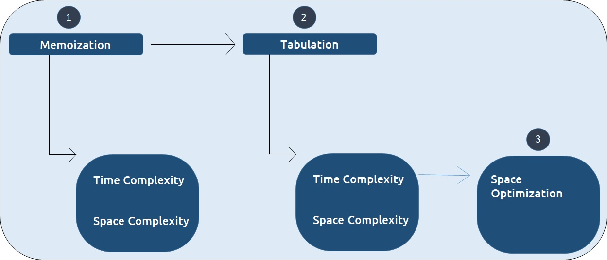

# Introduction to Dynamic Programming

!!! example "Dynamic Programming's quote"
    Those who can't remember their past, are condemned to repeat it.

- Dynamic Programming can be described as storing answers to various sub-problems to be used later whenever required to solve the main problem.

---

## Two approaches to solve DP

The two common dynamic programming approaches are:

- **Memoization**:
    -  **`top-down`**
    -  typically, **recursive**
    -  **`start from solving main problem, that requires base case to be solved, and then we come back to the main problem to solve it. (Top-Bottom-Top)`**
    -  **`slow due to lots of recursive calls`**
    -  **`the lookup table is filled on demand`**
    -  **`performs better if some time-consuming sub-problems in the subproblem space are not needed to be solved at all for the main problem`**

- **Tabulation**:
    - **`bottom-up`**
    - typically, **iterative**
    - **`Start from solving base case, and then gradually move towards the main problem to be solved.`**
    - **`more efficient`** as we directly access previous state
    - may calculate solution for the states, which are not even required by the main problem
    - harder to think solution, but since more efficient, plus, no recursive calls, gives upper edge in interview.

!!! bug "Note"
    The base case does not always mean smaller input. It depends upon the implementation of the algorithm.

---

## Comparison table


---

## Approach in DP 🫨



---

## Fibonacci problem

!!! danger "Fibonacci problem statement"
    We need to find the nth Fibonacci number, where n is based on a 0-based index.

    Every ith number of the series is equal to the sum of (i-1)th and (i-2)th number where the first and second number is given as 0 and 1 respectively.

    f(0) = 0, f(1) = 1, f(2) = 1, f(3) = 2, etc.

---

### Simple recursive method

- time complexity: O(2^n)
    - exponential time complexity. This is because each node in the recursion tree splits into two subbranches
- space complexity: O(1)

```cpp
int my_fib(int n){
    // base case: f(0)=0, f(1)=1
    if(n<2)
        return n;

    return my_fib(n - 1) + my_fib(n - 2);
}
```

---

### Memoization method

- time complexity: O(n)
- space complexity: O(2*n) // dp-array + recursive stack

```cpp
int my_memoization(int n, vector<int>&dp){
    // base case: f(0)=0, f(1)=1
    if (n < 2)
        return n;

    if (dp[n] != -1)
        return dp[n];

    return dp[n] = my_memoization(n - 1, dp) + my_memoization(n - 2, dp);
}

int my_fib(int n){
    vector<int> dp(n + 1, -1);
    return my_memoization(n, dp);
}
```

---

### Tabulation method

- time complexity: O(n)
- space complexity: O(n)

```cpp
int my_fib(int n){
    if(n<2)
        return n;

    vector<int> dp(n + 1, -1);

    dp[0] = 0;
    dp[1] = 1;

    for (int i = 2; i <= n;i++){
        dp[i] = dp[i - 1] + dp[i - 2];
    }
        return dp[n];
}
```

---

### Tabulation method with space optimization

- time complexity: O(n)
- space complexity: O(1)
- `we don't need the whole dp-array, we only need: *last* & *second-last*`

```cpp
int my_fib(int n)
{
    if (n < 2)
        return n;

    int ans;
    int last = 1, second_last = 0;

    for (int i = 2; i <= n; i++)
    {
        ans = last + second_last;
        second_last = last;
        last = ans;
    }
    return ans;
}
```
