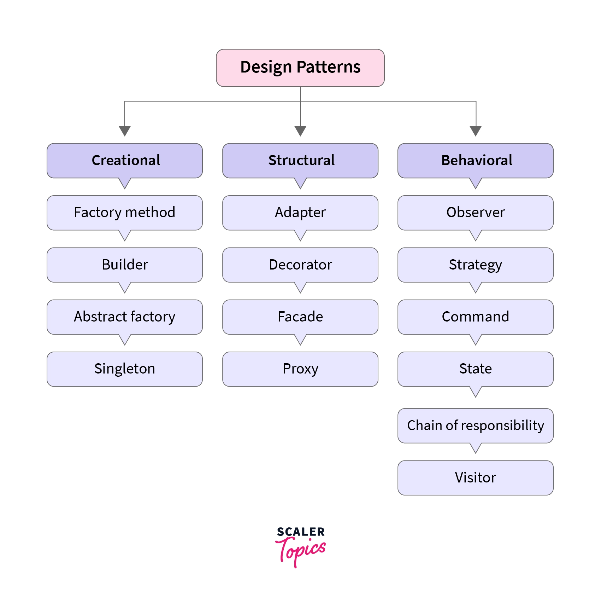

# Design Patterns

!!! info "Design Patterns"
    Design patterns are typical solutions to common problems in software design.

    - Each pattern is like a blueprint
    - that you can customize to solve a particular design problem in your code.

