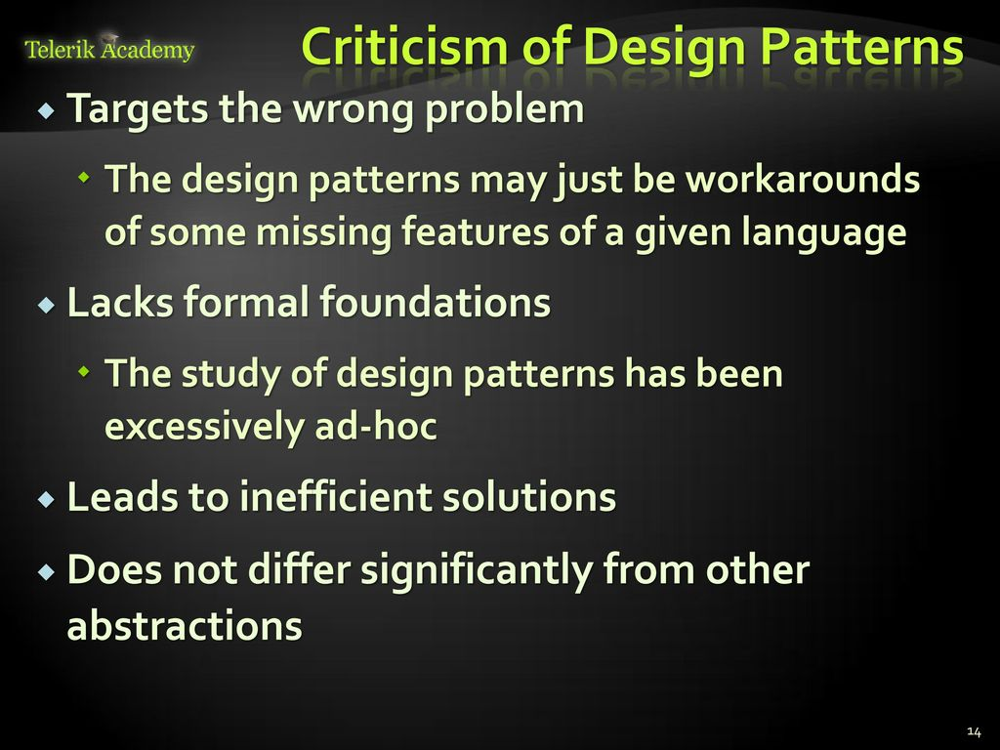

# What's a design pattern?

[Design patterns](https://refactoring.guru/design-patterns/catalog)

## Design Patterns

- Design patterns are typical solutions to commonly occurring problems in software design.
- They are like pre-made blueprints that you can customize to solve a recurring design problem in your code.

!!! tip ""
    You can’t just find a pattern and copy it into your program, the way you can with off-the-shelf functions or libraries. The pattern is not a specific piece of code, but a general concept for solving a particular problem. You can follow the pattern details and implement a solution that suits the realities of your own program.

!!! warning "Design Patterns Vs Algorithms"
    Patterns are often confused with algorithms, because both concepts describe typical solutions to some known problems. While an algorithm always defines a clear set of actions that can achieve some goal, a pattern is a more high-level description of a solution. The code of the same pattern applied to two different programs may be different.

    - An analogy to an algorithm is a cooking recipe: both have clear steps to achieve a goal.
    - On the other hand, a pattern is more like a blueprint: you can see what the result and its features are, but the exact order of implementation is up to you.

---

## History

`four authors: Erich Gamma, John Vlissides, Ralph Johnson, and Richard Helm`; in 1994, they published **Design Patterns: Elements of Reusable Object-Oriented Software**, in which they applied the concept of design patterns to programming.

- The **`book featured 23 patterns`** solving various problems of object-oriented design and became a best-seller very quickly.
- Due to its lengthy name, people started to call it “**the book by the gang of four**” which was soon shortened to simply “**the GoF book**”.

---

## Criticism

